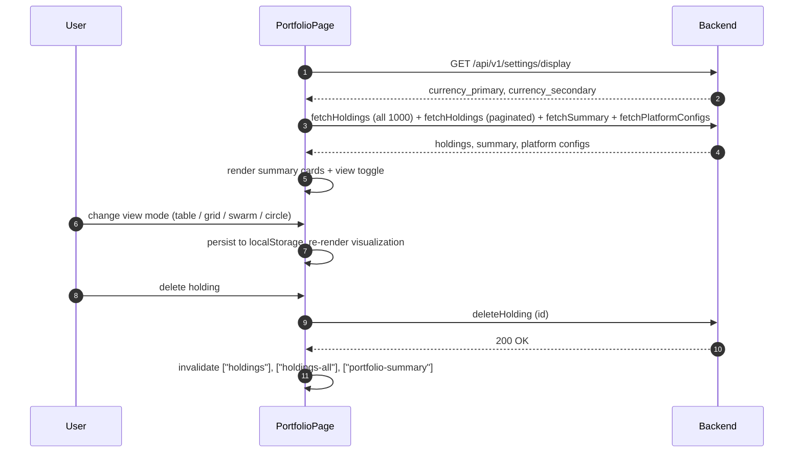

## Route
| Field | Value |
| :--- | :--- |
| Path | `/portfolio` |
| Auth guard | `(auth)` layout group |
| File | `frontend/app/(auth)/portfolio/page.tsx` |

## Component Tree
```
PortfolioPage
├── PageHeader
├── Link (→ /import)
├── AddTransactionDialog
├── AddHoldingDialog
├── PortfolioViewToggle
├── Card (Total Value)
│   └── DualCurrencyAmount
├── Card (Today P/L)
│   └── DualCurrencyAmount
├── PlatformBreakdownCards
├── [view: table]
│   └── HoldingsTable
├── [view: grid]
│   └── TreemapView
├── [view: swarm]
│   └── BeeswarmView
├── [view: circle]
│   └── CirclepackView
└── CashAccountsSection
```

## Data Layer

### Server State — React Query
| Query key | Endpoint | Purpose |
| :--- | :--- | :--- |
| `["holdings-all"]` | `fetchHoldings({ page: 1, page_size: 1000 })` | All holdings for visualization views |
| `["holdings", tableParams]` | `fetchHoldings(tableParams)` | Paginated holdings for table view |
| `["portfolio-summary"]` | `fetchSummary()` | Total value, P/L, exchange rate, currency settings |
| `["platform-configs"]` | `fetchPlatformConfigs()` | Platform color mapping |

### Global State — Zustand
| Store | Fields used |
| :--- | :--- |
| None | — |

### Local State — `useState`
| Variable | Type | Purpose |
| :--- | :--- | :--- |
| `primaryCurrency` | `string` | Primary display currency (default: "THB"), overridden by settings API |
| `secondaryCurrency` | `string` | Secondary display currency (default: "USD"), overridden by settings API |
| `portfolioView` | `ViewMode` | Active visualization mode: "table" / "grid" / "swarm" / "circle"; persisted to `localStorage` |

## Page Lifecycle


## Validation & Conditions

### Form Validation (if any)
| Rule | Where enforced |
| :--- | :--- |
| None on this page | Forms are inside AddHoldingDialog / AddTransactionDialog components |

### Render Conditions
| Condition | Rendered |
| :--- | :--- |
| `portfolioView === "table"` | `HoldingsTable` (with `Skeleton` while `holdingsPage` is undefined) |
| `portfolioView === "grid"` | `TreemapView` |
| `portfolioView === "swarm"` | `BeeswarmView` |
| `portfolioView === (default)` | `CirclepackView` |
| `allHoldingsPage` is undefined (non-table view) | Full-height `Skeleton` placeholder |
| `holdingsFetching` | `isFetching` prop passed to `HoldingsTable` |

## Related
- Component - HoldingsTable
- Component - AddHoldingDialog
- Component - PortfolioViewToggle
