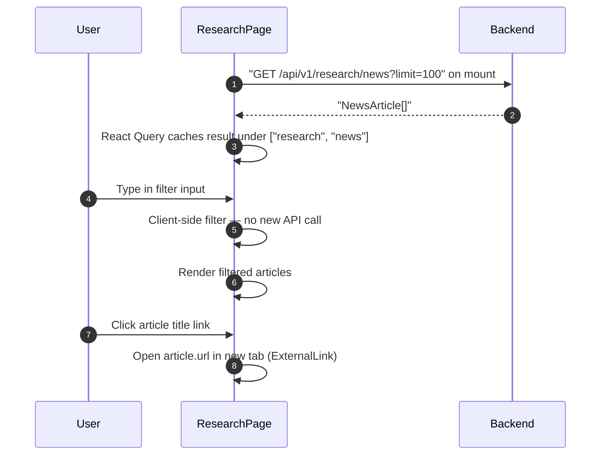

## Route
| Field | Value |
| :--- | :--- |
| Path | `/research` |
| Auth guard | `(auth)` layout |
| File | `frontend/app/(auth)/research/page.tsx` |

## Component Tree
```
ResearchPage
├── PageHeader (title="Research Library")
└── Card
    ├── CardHeader
    │   ├── CardTitle (NewspaperIcon — "News Index")
    │   └── article count badge
    └── CardContent
        ├── Input (filter — title/symbol/source)
        └── Article list (filtered)
            └── per NewsArticle
                ├── title (ExternalLinkIcon link → article.url)
                ├── symbol badge
                ├── source
                └── published_at / fetched_at
```

## Data Layer

### Server State — React Query
| Query key | Endpoint | Purpose |
| :--- | :--- | :--- |
| `["research", "news"]` | `GET /api/v1/research/news?limit=100` | Fetch full news library (up to 100 articles) |

### Global State — Zustand
None.

### Local State — useState
| Variable | Type | Purpose |
| :--- | :--- | :--- |
| `filter` | `string` | Client-side filter string for title/symbol/source |

## Page Lifecycle


## Validation & Conditions

### Form Validation
None — filter is purely client-side, read-only page.

### Render Conditions
| Condition | Rendered |
| :--- | :--- |
| `isLoading === true` | Skeleton cards |
| `filtered.length === 0` | Empty state / no results message |
| `filter.trim()` truthy | Articles filtered by title, symbol, or source |
| `filter.trim()` falsy | All 100 articles shown |
| `article.url` present | ExternalLinkIcon link rendered |

## Related
- Page - Documents
- `frontend/lib/api.ts`
