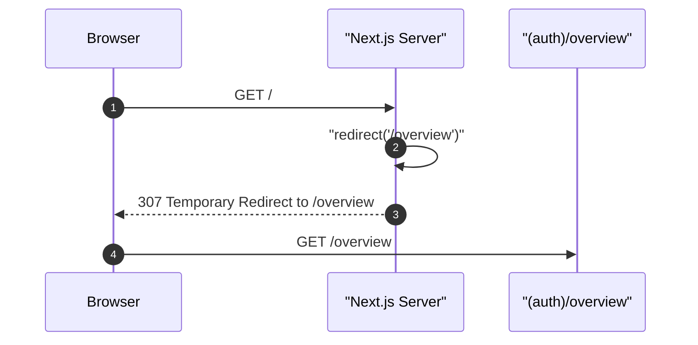

## Route

| Field | Value |
| :--- | :--- |
| Path | `/` |
| Auth guard | None — server component |
| File | `frontend/app/page.tsx` |

---

## Purpose

This is a Next.js server component that immediately calls `redirect("/overview")`. It exists only to handle the root URL — the actual dashboard content lives in `frontend/app/(auth)/page.tsx` (the Overview page inside the auth group).

```typescript
import { redirect } from "next/navigation";

export default function RootPage() {
  redirect("/overview");
}
```

---

## Component Tree

None — this file contains no JSX. It immediately redirects.

---

## Data Layer

None — no data fetching, no state, no queries.

---

## Page Lifecycle



---

## Related

- Page - Overview
- Page - Login
