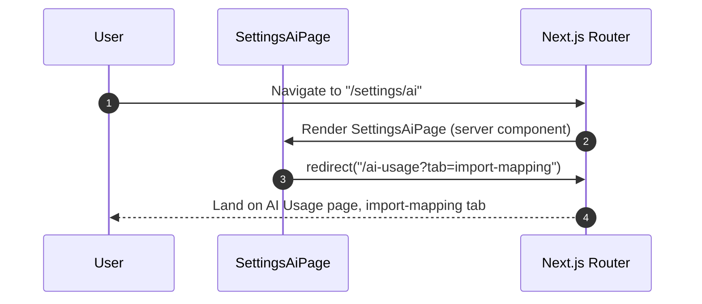

## Route
| Field | Value |
| :--- | :--- |
| Path | `/settings/ai` |
| Auth guard | `(auth)` layout |
| File | `frontend/app/(auth)/settings/ai/page.tsx` |

## Component Tree
```
SettingsAiPage
└── (immediate server-side redirect — no UI rendered)
```

## Data Layer

### Server State — React Query
None.

### Global State — Zustand
None.

### Local State — useState
None.

## Page Lifecycle


## Validation & Conditions

### Form Validation
None — page is a pure redirect.

### Render Conditions
| Condition | Rendered |
| :--- | :--- |
| Always | Immediate redirect, no UI |

## Related
- Page - AI Usage
- Page - Settings
- `frontend/app/(auth)/settings/ai/page.tsx`
