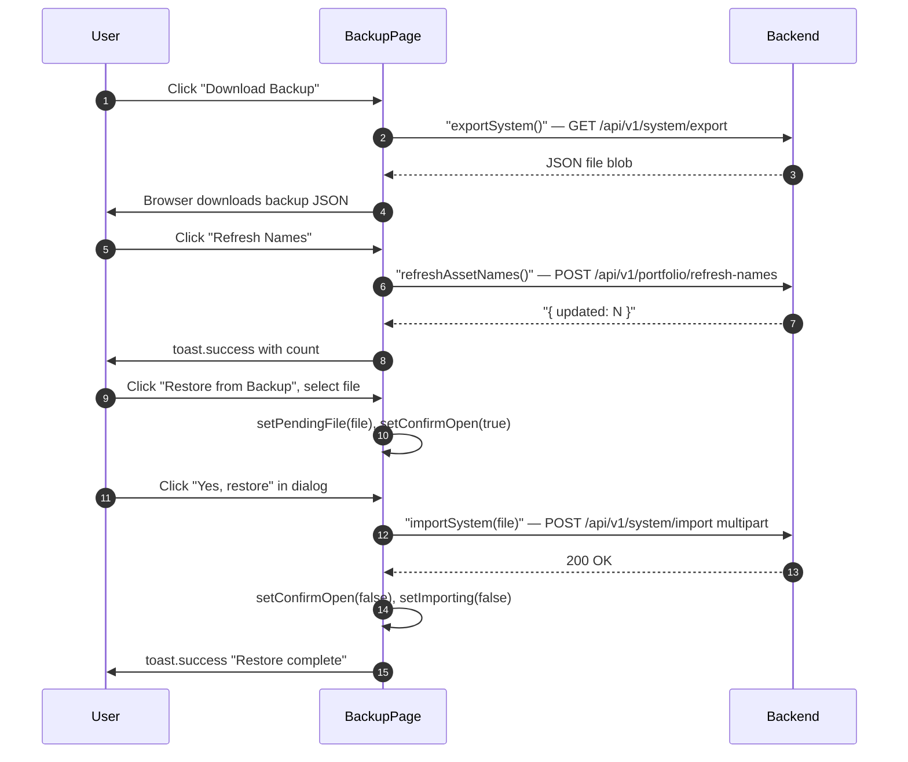

## Route
| Field | Value |
| :--- | :--- |
| Path | `/settings/backup` |
| Auth guard | `(auth)` layout |
| File | `frontend/app/(auth)/settings/backup/page.tsx` |

## Component Tree
```
BackupPage
├── PageHeader (title="Backup and Restore")
├── Security warning banner (amber border)
├── Card — Refresh Asset Names
│   └── Button "Refresh Names"
├── Card — Export
│   └── Button "Download Backup"
├── Card — Restore
│   ├── Hidden input type="file" (via fileInputRef)
│   └── Button "Restore from Backup" (destructive)
└── Dialog — Confirm Restore
    ├── "Replace all data?" warning
    ├── Button "Cancel"
    └── Button "Yes, restore" (destructive)
```

## Data Layer

### Server State — React Query
None — direct service function calls.

### Global State — Zustand
None.

### Local State — useState
| Variable | Type | Purpose |
| :--- | :--- | :--- |
| `exporting` | `boolean` | Export download in-flight |
| `importing` | `boolean` | Restore import in-flight |
| `refreshing` | `boolean` | Asset name refresh in-flight |
| `pendingFile` | `File \| null` | File selected but not yet confirmed for restore |
| `confirmOpen` | `boolean` | Confirmation dialog open/close |

### Refs
| Ref | Purpose |
| :--- | :--- |
| `fileInputRef` | Hidden file input triggered by the Restore button |

## Page Lifecycle


## Validation & Conditions

### Form Validation
- File input accepts only `.json` files (`accept=".json"`).
- Restore requires a two-step confirmation dialog — file selection alone does not trigger the import.
- `handleConfirmImport()` calls `importSystem(pendingFile)` only after user confirms in the dialog.

### Render Conditions
| Condition | Rendered |
| :--- | :--- |
| `exporting === true` | Export button disabled + "Exporting..." text |
| `importing === true` | Restore button disabled + "Restoring..." text |
| `refreshing === true` | Refresh button disabled + "Refreshing..." text |
| `confirmOpen === true` | Confirmation dialog visible |
| Always | Security warning banner (backup files contain API keys in plaintext) |

## Related
- Page - Settings
- Page - Setup
- `frontend/lib/services/system.ts`
- `frontend/lib/services/portfolio.ts`
