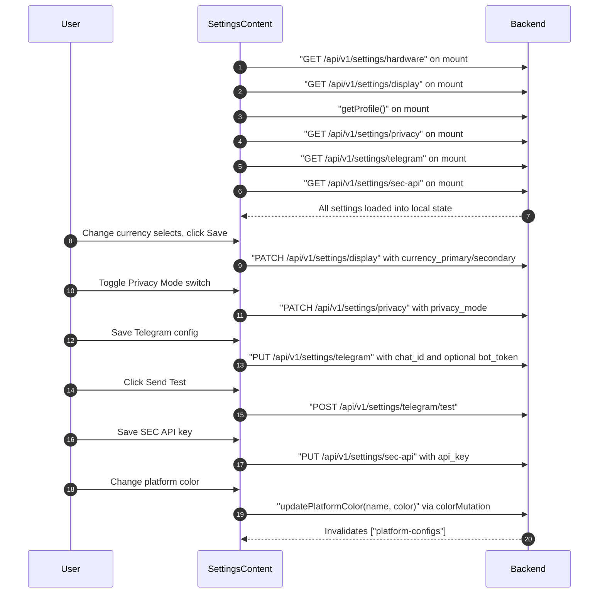

## Route
| Field | Value |
| :--- | :--- |
| Path | `/settings` |
| Auth guard | `(auth)` layout |
| File | `frontend/app/(auth)/settings/page.tsx` |

## Component Tree
```
SettingsPage (Suspense boundary)
└── SettingsContent
    ├── PageHeader (title="Settings")
    └── Tabs (controlled by ?tab= URL param)
        ├── TabsList
        │   ├── TabsTrigger "general"
        │   ├── TabsTrigger "ai"
        │   ├── TabsTrigger "schedule"
        │   └── TabsTrigger "platform"
        ├── TabsContent "general"
        │   ├── Card — Display / Currency
        │   │   ├── Select (currency_primary)
        │   │   ├── Select (currency_secondary)
        │   │   └── Button "Save"
        │   ├── Card — Profile
        │   │   ├── DatePicker (birth_date)
        │   │   ├── Input (plan_to_age)
        │   │   └── Button "Save"
        │   ├── Card — Privacy
        │   │   └── Switch (privacy_mode — via usePrivacyStore)
        │   ├── Card — Hardware
        │   │   └── Skeleton / hardware info (cpu, ram, recommendation)
        │   ├── Card — Telegram Notifications
        │   │   ├── Input (bot_token)
        │   │   ├── Input (chat_id)
        │   │   ├── Button "Save"
        │   │   └── Button "Send Test"
        │   └── Card — SEC EDGAR API
        │       ├── Input (api_key)
        │       ├── Button "Save"
        │       └── Button "Remove"
        ├── TabsContent "ai"
        │   └── AISettings component
        ├── TabsContent "schedule"
        │   └── ScheduleTab component
        └── TabsContent "platform"
            └── Platform color pickers (per unique platform)
```

## Data Layer

### Server State — React Query
| Query key | Endpoint | Purpose |
| :--- | :--- | :--- |
| `["platform-configs"]` | `fetchPlatformConfigs()` | Load platform name → color mapping |
| `["holdings-all-settings"]` | `fetchHoldings({ page: 1, page_size: 1000 })` | Derive unique platform names |

### Mutations
| Mutation | Endpoint | Purpose |
| :--- | :--- | :--- |
| `colorMutation` | `updatePlatformColor(name, color)` | Save platform color, invalidates `["platform-configs"]` |

### Global State — Zustand
| Store | Hook | Usage |
| :--- | :--- | :--- |
| `privacy` store | `usePrivacyStore` | `isPrivate`, `setPrivate` — privacy mode toggle |

### Local State — useState
| Variable | Type | Purpose |
| :--- | :--- | :--- |
| `hardware` | `HardwareInfo \| null` | Hardware detection result |
| `currencyPrimary` | `string` | Primary display currency (default `"THB"`) |
| `currencySecondary` | `string` | Secondary display currency |
| `profile` | `ProfileSettings \| null` | User profile (birth_date, plan_to_age) |
| `birthDate` | `string` | Date of birth for profile card |
| `planToAge` | `string` | Target planning age (default `"85"`) |
| `pendingColors` | `Record<string, string>` | Draft platform colors before save |
| `telegramToken` | `string` | Bot token input (write-only) |
| `telegramChatId` | `string` | Chat ID input |
| `telegramHasToken` | `boolean` | Whether a token is already saved on backend |
| `telegramTesting` | `boolean` | Test message in-flight |
| `secApiKey` | `string` | SEC EDGAR API key input (write-only) |
| `secApiHasKey` | `boolean` | Whether a key is already saved on backend |

## Page Lifecycle


## Validation & Conditions

### Form Validation
- `saveSecApiKey()` returns early if `secApiKey` is empty.
- Telegram token is optional on save if `telegramHasToken` is already true.
- `saveProfileSettings()` only sends non-empty fields.

### Render Conditions
| Condition | Rendered |
| :--- | :--- |
| `hardware === null` | Skeleton in Hardware card |
| `telegramHasToken === true` | Token field shows masked placeholder |
| `secApiHasKey === true` | "Remove" button visible |
| `profile?.current_age != null` | Planning horizon info (current_age, target_year, years_remaining) |
| Active tab from `?tab=` param | Correct TabsContent shown |

## Related
- Page - Settings AI
- Page - Settings Backup
- `frontend/store/privacy.ts`
- `frontend/components/settings/AISettings.tsx`
- `frontend/components/settings/ScheduleTab.tsx`
- `frontend/lib/services/platform-configs.ts`
