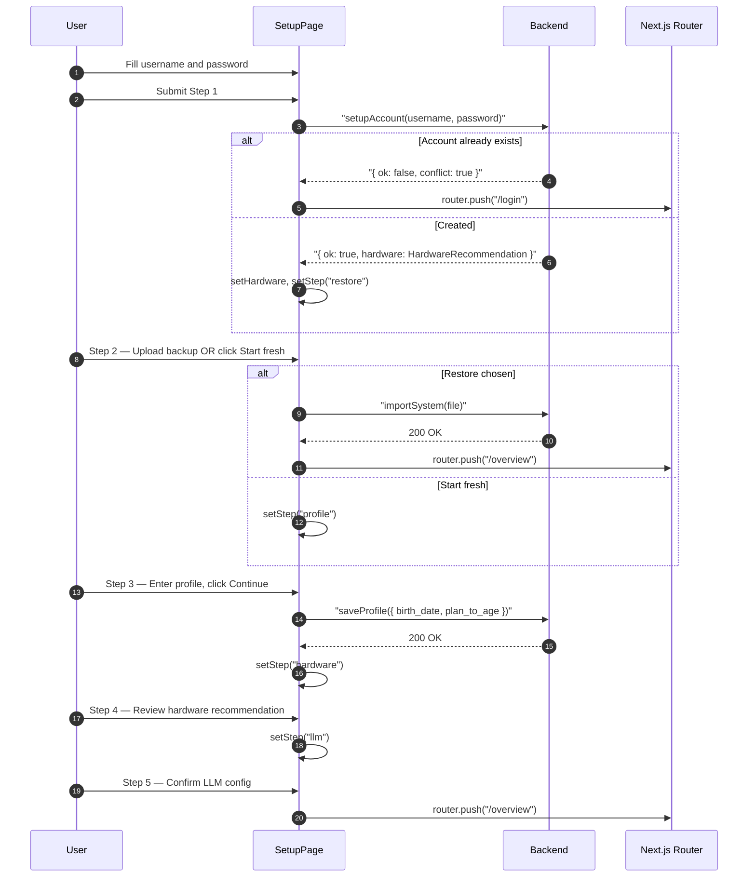

## Route
| Field | Value |
| :--- | :--- |
| Path | `/setup` |
| Auth guard | None — public route |
| File | `frontend/app/setup/page.tsx` |

## Component Tree
```
SetupPage
└── div (min-h-screen centered)
    └── Card (max-w-md) — rendered per step
        ├── CardHeader
        │   ├── CardTitle (step-specific)
        │   ├── p (step N of 5)
        │   └── Progress bar
        └── CardContent (step-specific form)

Step 1 — "account"
└── form (onSubmit=handleCreateAccount)
    ├── Input (username — required)
    ├── Input (password — type="password", minLength=8, required)
    └── Button "Create Account"

Step 2 — "restore"
└── Two buttons
    ├── Button "Upload backup file" (hidden file input, accepts .json)
    └── Button "Start fresh" → setStep("profile")

Step 3 — "profile"
└── Fields
    ├── DatePicker (birth_date)
    ├── Input (plan_to_age — default 85)
    ├── Button "Skip for now" → setStep("hardware")
    └── Button "Continue" → handleSaveProfile()

Step 4 — "hardware"
└── HardwareRecommendation card
    ├── recommended_model, note
    ├── setup_command (if can_run_local_llm)
    └── Button "Continue" → setStep("llm")

Step 5 — "llm"
└── LLM provider selection / confirmation
    └── Button "Finish" → router.push("/overview")
```

## Data Layer

### Server State — React Query
None — direct service function calls.

### Global State — Zustand
None.

### Local State — useState
| Variable | Type | Purpose |
| :--- | :--- | :--- |
| `step` | `"account" \| "restore" \| "profile" \| "hardware" \| "llm"` | Current wizard step |
| `username` | `string` | Account username input |
| `password` | `string` | Account password input |
| `hardware` | `HardwareRecommendation \| null` | Hardware detection from `setupAccount()` response |
| `birthDate` | `string` | Date of birth for profile step |
| `planToAge` | `string` | Target planning age (default `"85"`) |
| `loading` | `boolean` | Async operation in-flight |
| `restoreError` | `string \| null` | Error message from backup restore attempt |

## Page Lifecycle


## Validation & Conditions

### Form Validation
- Step 1: `username` required, `password` required + `minLength={8}`.
- Step 2: File input accepts only `.json`. Restore errors surface in `restoreError` state with inline message.
- Step 3: Both profile fields are optional — "Skip for now" bypasses them.
- If `setupAccount()` returns `conflict: true`, user is redirected to `/login` (account already exists).

### Render Conditions
| Condition | Rendered |
| :--- | :--- |
| `step === "account"` | Username/password creation form |
| `step === "restore"` | Backup upload or "Start fresh" choice |
| `step === "profile"` | Birth date + plan age form |
| `step === "hardware"` | Hardware detection + LLM recommendation |
| `step === "llm"` | LLM provider setup step |
| `loading === true` | Buttons disabled with loading text |
| `restoreError !== null` | Inline error message in restore step |
| `hardware?.can_run_local_llm` | Shows `setup_command` code block |
| `hardware === null` in step 4 | "Hardware detection unavailable" fallback message |

## Related
- Page - Login
- Page - Settings Backup
- `frontend/lib/services/auth.ts`
- `frontend/lib/services/system.ts`
