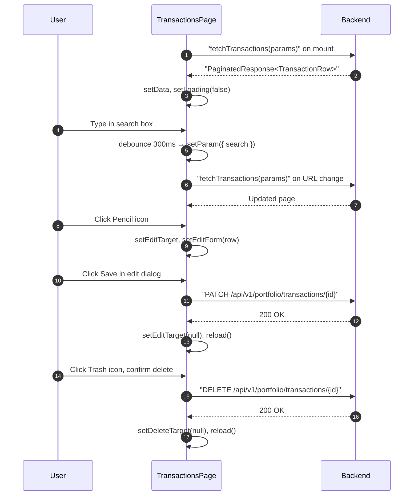

## Route
| Field | Value |
| :--- | :--- |
| Path | `/transactions` |
| Auth guard | `(auth)` layout |
| File | `frontend/app/(auth)/transactions/page.tsx` |

## Component Tree
```
TransactionsPage
├── PageHeader (title="Transactions")
├── Filter bar
│   ├── Input (search — debounced 300ms → URL)
│   ├── Select (type filter)
│   ├── Select (platform filter — derived from current page data)
│   └── DateRangePicker (date_from / date_to → URL)
├── Table (shadcn)
│   ├── TableHeader
│   └── TableBody
│       └── TableRow (per transaction)
│           ├── TickerLogo
│           ├── DualCurrencyAmount (price, total)
│           ├── Badge (type color)
│           ├── Button (Pencil → edit dialog)
│           └── Button (Trash2 → delete dialog)
├── Pagination controls
├── Dialog — Edit Transaction
│   ├── Select (type)
│   ├── Input (quantity, price, fee, platform, executed_at)
│   └── Button "Save"
└── Dialog — Delete Confirmation
    └── Button "Delete" (destructive)
```

## Data Layer

### Server State — React Query
None — uses direct `fetchTransactions` service + `useEffect` driven by URL params.

### Global State — Zustand
None (uses `useDualCurrency` hook for formatting).

### Local State — useState
| Variable | Type | Purpose |
| :--- | :--- | :--- |
| `data` | `PaginatedResponse<TransactionRow>` | Current page of transactions |
| `loading` | `boolean` | Initial load skeleton |
| `fetching` | `boolean` | Subsequent fetch overlay |
| `editTarget` | `TransactionRow \| null` | Row currently being edited |
| `deleteTarget` | `TransactionRow \| null` | Row pending deletion confirmation |
| `editForm` | `Partial<TransactionRow>` | Draft edits before save |
| `saving` | `boolean` | Edit save in-flight |
| `deleting` | `boolean` | Delete in-flight |
| `searchInput` | `string` | Controlled search field (debounced to URL) |

### URL Params (via `useTableParams`)
| Param | Default | Purpose |
| :--- | :--- | :--- |
| `search` | — | Full-text search |
| `type` | — | Transaction type filter |
| `platform` | — | Platform filter |
| `date_from` | — | Range start |
| `date_to` | — | Range end |
| `page` | `1` | Current page |
| `page_size` | `25` | Rows per page |

## Page Lifecycle


## Validation & Conditions

### Form Validation
- Edit form fields are uncontrolled strings parsed with `parseFloat` on save.
- No client-side required validation — backend returns errors on bad input.

### Render Conditions
| Condition | Rendered |
| :--- | :--- |
| `loading === true` | Skeleton rows |
| `fetching === true` | Opacity overlay on table |
| `editTarget !== null` | Edit dialog open |
| `deleteTarget !== null` | Delete confirmation dialog open |
| `data.items.length === 0` | Empty state message |
| Type badge color | `TYPE_COLORS[row.type]` map |

## Related
- Page - Import
- `frontend/lib/services/portfolio.ts`
- `frontend/components/ui/DualCurrencyAmount.tsx`
- `frontend/hooks/useTableParams.ts`
