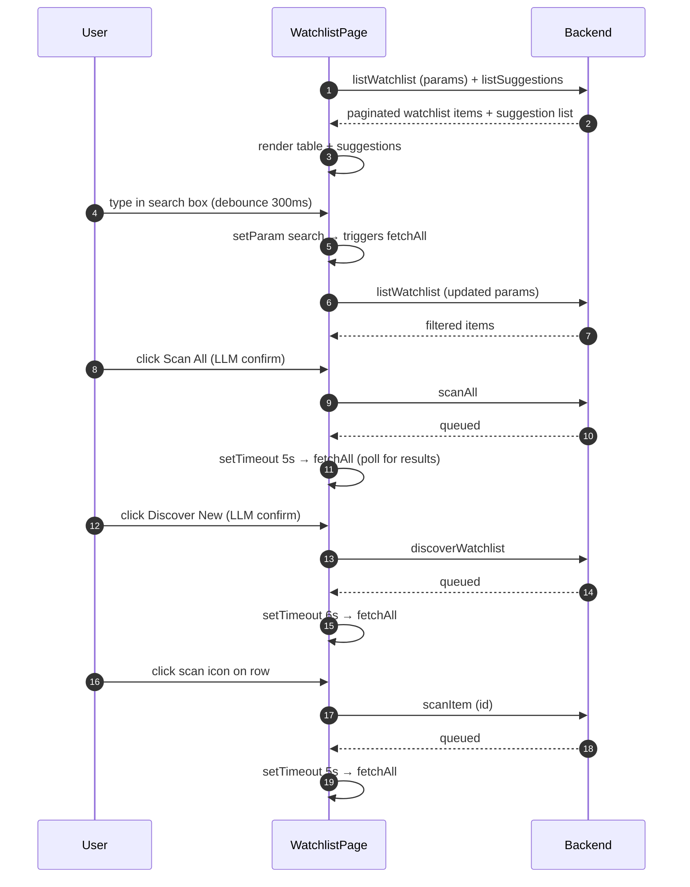

## Route
| Field | Value |
| :--- | :--- |
| Path | `/watchlist` |
| Auth guard | `(auth)` layout group |
| File | `frontend/app/(auth)/watchlist/page.tsx` |

## Component Tree
```
WatchlistPage
├── PageHeader
├── [toolbar]
│   ├── Input (search)
│   ├── Select (asset_type filter)
│   ├── Select (alert_status filter)
│   ├── Button (Add → opens AddDialog)
│   ├── Button (Scan All → opens ConfirmLLMDialog)
│   └── Button (Discover New → opens ConfirmLLMDialog)
├── ConfirmLLMDialog (scan / discover confirmation)
├── AddDialog (internal component)
│   ├── Input (ticker search)
│   ├── [results list] (from /api/v1/assets/search)
│   └── Input (target price)
├── [table area]
│   ├── Skeleton (while loading)
│   └── Table
│       └── TableRow (per WatchlistItem)
│           ├── TickerLogo
│           ├── DualCurrencyAmount (price, target, AI price)
│           └── [action buttons: scan, alert toggle, delete, apply AI price]
├── [pagination]
└── [suggestions section]
    └── [suggestion cards with Accept / Dismiss]
```

## Data Layer

### Server State — React Query
| Query key | Endpoint | Purpose |
| :--- | :--- | :--- |
| Not used | — | Data is fetched via `useCallback fetchAll` + manual `useState`, not React Query |

### Global State — Zustand
| Store | Fields used |
| :--- | :--- |
| None | — |

### Local State — `useState`
| Variable | Type | Purpose |
| :--- | :--- | :--- |
| `itemsPage` | `PaginatedResponse<WatchlistItem>` | Current page of watchlist items |
| `searchInput` | `string` | Controlled search input value (debounced to URL param) |
| `suggestions` | `WatchlistSuggestion[]` | AI-suggested tickers to add |
| `loading` | `boolean` | True while `fetchAll` is in flight |
| `scanningAll` | `boolean` | True while global scan is running |
| `discovering` | `boolean` | True while LLM discovery is running |
| `scanningId` | `string \| null` | ID of the item currently being individually scanned |
| `addOpen` | `boolean` | Controls AddDialog visibility |
| `llmConfirm` | `{ action: "scan" \| "discover"; open: boolean }` | Controls LLM confirmation dialog state |
| `query` (AddDialog) | `string` | Ticker search input in add dialog |
| `results` (AddDialog) | `AssetResult[]` | Search results from `/api/v1/assets/search` |
| `selected` (AddDialog) | `AssetResult \| null` | Selected asset to add |
| `targetPrice` (AddDialog) | `string` | Optional target price input |
| `adding` (AddDialog) | `boolean` | Loading state while adding to watchlist |

## Page Lifecycle


## Validation & Conditions

### Form Validation (if any)
| Rule | Where enforced |
| :--- | :--- |
| Asset must be selected before adding | `disabled={!selected \|\| adding}` on Add button in AddDialog |
| Target price is optional | No validation — empty string is sent as-is |
| LLM config must exist for discover | Backend returns error `no_llm_config`; handled in `handleDiscover` catch |

### Render Conditions
| Condition | Rendered |
| :--- | :--- |
| `loading` is true | Skeleton grid |
| `itemsPage.items.length === 0` | Empty state message |
| `itemsPage.items.length > 0` | Full table |
| `itemsPage.total > itemsPage.page_size` | Pagination controls |
| `suggestions.length > 0` | Suggestions section with Accept / Dismiss cards |
| `item.ai_suggested_price` exists | "Apply AI Price" button shown in row |
| `item.alerted_at && !item.alert_enabled` | Rearm path in `handleToggleAlert` |

## Related
- Component - ConfirmLLMDialog
- Component - TickerLogo
