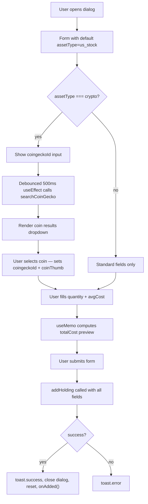

## Purpose
Modal dialog for adding a new holding to the portfolio. Supports all asset types; when `crypto` is selected, a live CoinGecko search autocomplete activates to resolve the `coingecko_id` and logo. Derives a live total-cost preview from quantity × avg cost. On success, calls `onAdded` so the parent refreshes its data.

## Props
| Prop | Type | Required | Notes |
| :--- | :--- | :--- | :--- |
| `primaryCurrency` | `string` | Yes | Pre-fills the currency field |
| `onAdded` | `() => void` | Yes | Callback fired after successful submission |

## Component Tree
```
AddHoldingDialog
├── DialogTrigger → Button "Add Holding"
└── DialogContent
    └── form
        ├── Select (assetType)
        ├── Input (symbol)
        ├── DatePicker (purchasedAt)
        ├── Input (quantity)
        ├── Input (avgCost)
        ├── Input (currency)
        ├── [if crypto] Input (coingeckoId) + coin results dropdown
        └── Total cost preview + Submit Button
```

## Data Layer

### Local State
| Variable | Type | Purpose |
| :--- | :--- | :--- |
| `open` | `boolean` | Dialog open/close |
| `symbol` | `string` | Ticker symbol |
| `assetType` | `string` | Selected asset type (default: `"us_stock"`) |
| `purchasedAt` | `string` | ISO date string |
| `quantity` | `string` | Number of shares/units |
| `avgCost` | `string` | Average cost per unit |
| `currency` | `string` | Currency code (initialised from `primaryCurrency`) |
| `loading` | `boolean` | Submission in-flight |
| `coingeckoId` | `string` | CoinGecko coin ID (crypto only) |
| `coinThumb` | `string` | Thumbnail URL from CoinGecko result |
| `coinResults` | `CoinGeckoResult[]` | Autocomplete results |

### React Query
Not used; `addHolding` and `searchCoinGecko` are called imperatively.

## Behavior


## Related
- Component - EditHoldingDialog
- Component - HoldingsTable
- Page - Portfolio
