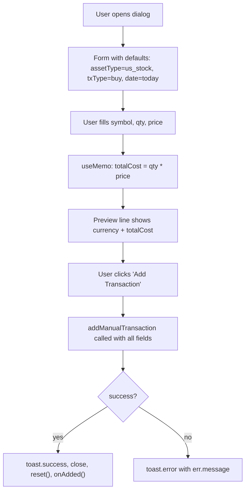

## Purpose
Modal dialog for manually recording a financial transaction (buy, sell, dividend, reward, fee, transfer) against any asset type. Computes a live total-value preview (quantity × price). Calls `onAdded` on success so the parent refreshes.

## Props
| Prop | Type | Required | Notes |
| :--- | :--- | :--- | :--- |
| `primaryCurrency` | `string` | Yes | Pre-fills the currency field |
| `onAdded` | `() => void` | Yes | Callback fired after successful submission |

## Component Tree
```
AddTransactionDialog
├── DialogTrigger → Button "Add Transaction" (outline, rounded-full)
└── DialogContent
    └── form
        ├── Input (symbol)
        ├── Select (assetType)
        ├── Select (txType)
        ├── DatePicker (executedAt)
        ├── Input (quantity)
        ├── Input (price)
        ├── Input (fee — optional)
        ├── Input (currency)
        ├── Input (platform — optional)
        ├── Total value preview
        └── Submit Button
```

## Data Layer

### Local State
| Variable | Type | Purpose |
| :--- | :--- | :--- |
| `open` | `boolean` | Dialog open/close |
| `symbol` | `string` | Ticker symbol (uppercased) |
| `assetType` | `string` | Default: `"us_stock"` |
| `txType` | `string` | Transaction type; default: `"buy"` |
| `quantity` | `string` | Units transacted |
| `price` | `string` | Price per unit |
| `fee` | `string` | Transaction fee (optional, defaults `"0"`) |
| `currency` | `string` | Initialised from `primaryCurrency` |
| `platform` | `string` | Broker/platform (optional) |
| `executedAt` | `string` | ISO date; defaults to today |
| `loading` | `boolean` | Submission in-flight |

### React Query
Not used; calls `addManualTransaction` imperatively from `@/lib/services/portfolio`.

## Behavior


## Related
- Component - AddHoldingDialog
- Component - HoldingsTable
- Page - Portfolio
