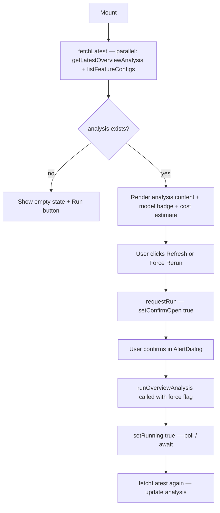

## Purpose
Displays the latest AI-generated portfolio analysis on the Overview page. Fetches the most recent `OverviewAnalysis` on mount, shows its markdown content, model badge, timestamp, and estimated cost. Provides "Refresh" and "Force Rerun" buttons with a confirmation dialog before triggering an expensive LLM call.

## Props
None — fully self-contained.

## Component Tree
```
AIAnalysisCard
├── Card
│   ├── CardHeader
│   │   ├── BrainCircuitIcon
│   │   ├── Badge (model name)
│   │   └── Buttons — RefreshCwIcon / ZapIcon
│   └── CardContent
│       ├── Loading skeleton (loading=true)
│       ├── Error state
│       ├── Empty state
│       └── Analysis markdown + cost estimate
└── AlertDialog (confirm before force-run)
```

## Data Layer

### Local State
| Variable | Type | Purpose |
| :--- | :--- | :--- |
| `analysis` | `OverviewAnalysis \| null` | Latest analysis fetched from API |
| `loading` | `boolean` | Initial fetch in-flight |
| `running` | `boolean` | LLM run triggered and in-flight |
| `error` | `string \| null` | Fetch/run error message |
| `confirmOpen` | `boolean` | Controls confirm AlertDialog visibility |
| `pendingForce` | `boolean` | Whether pending trigger is a force-rerun |
| `configuredModel` | `string \| undefined` | Model name from feature config |

### React Query
Not used — data fetched imperatively via `getLatestOverviewAnalysis()` and `listFeatureConfigs()` in a `useCallback` / `useEffect` pair.

## Behavior


## Related
- Component - KpiCards
- Page - Overview
