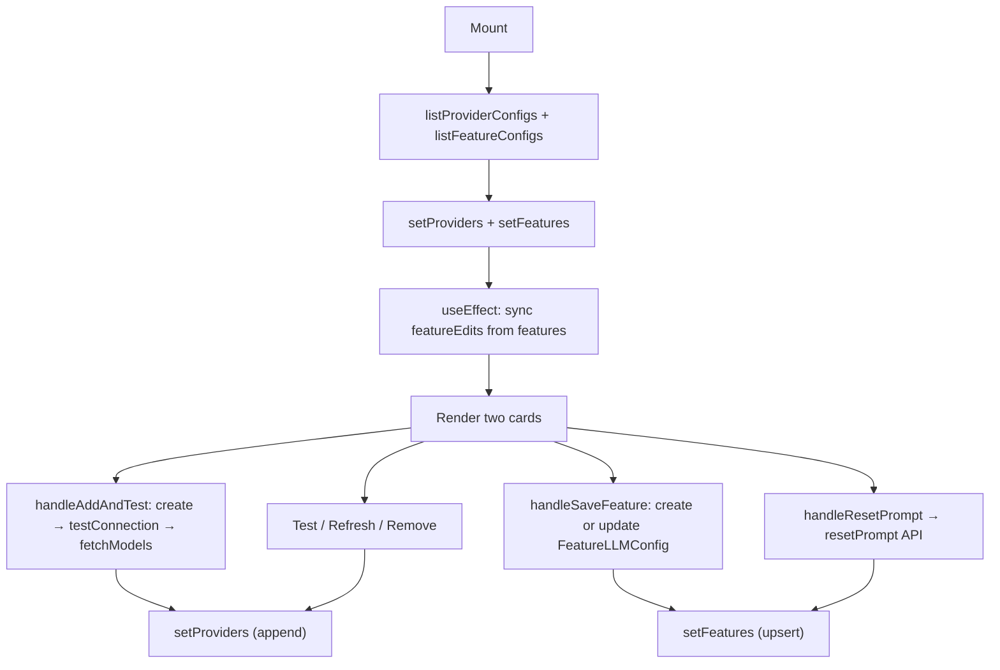

## Purpose
Full-page settings panel for managing LLM providers and per-feature model assignments. Renders two cards: "AI Providers" (add/test/remove provider configs) and "LLM Assignment" (bind a provider + model + system prompt to each app feature). All data fetched directly via service functions — no React Query.

## Usage

```tsx
<AISettings />
```

Used in: Page - Settings AI

## Props Interface

No props — self-contained component.

## State

### Local State — `useState`

| Variable | Type | Initial | Purpose |
| :--- | :--- | :--- | :--- |
| `providers` | `ProviderConfig[]` | `[]` | List of configured LLM providers |
| `features` | `FeatureLLMConfig[]` | `[]` | Per-feature LLM assignments from server |
| `loadingProviders` | `boolean` | `true` | Skeleton guard for provider list |
| `loadingFeatures` | `boolean` | `true` | Skeleton guard for feature list |
| `newProvider` | `Provider` | `"anthropic"` | Dropdown value for add-provider form |
| `newApiKey` | `string` | `""` | API key input for cloud providers |
| `newHostUrl` | `string` | `""` | Host URL input for Ollama |
| `adding` | `boolean` | `false` | Disables "Add & Test" during creation |
| `addError` | `string \| null` | `null` | Error from add flow |
| `addStatus` | `string \| null` | `null` | Progress label during add flow |
| `actionStates` | `Record<string, {...}>` | `{}` | Per-provider testing/refreshing/removing/error state |
| `featureEdits` | `Record<string, FeatureEdit>` | `{}` | Dirty edits for each feature row |
| `featureSaving` | `Record<string, boolean>` | `{}` | Per-feature save spinner |
| `featureErrors` | `Record<string, string>` | `{}` | Per-feature save error message |

### Global State — Zustand

None.

### Server State — React Query

Not used. Data is fetched imperatively via `useEffect` + `listProviderConfigs()` / `listFeatureConfigs()` from service modules.

## Component Tree

```
AISettings
├── Card "AI Providers"
│   ├── providers.map → provider row (Badge + Test / Refresh Models / Remove buttons)
│   └── "Add Provider" form
│       ├── Select (provider type)
│       ├── Input (API key | host URL)
│       └── Button "Add & Test"
└── Card "LLM Assignment"
    └── FEATURE_KEYS.map → feature row
        ├── Select (provider)
        ├── ModelCombobox (model — with CommandPalette search)
        │   └── ModelTooltip (info icon → recommendation popup)
        ├── Textarea (system prompt)
        └── Button "Save" + Button "Reset Prompt"
```

## Lifecycle



## Events & Handlers

| Event | Handler | What it does |
| :--- | :--- | :--- |
| Click "Add & Test" | `handleAddAndTest` | createProviderConfig → testConnection → fetchModels in sequence |
| Click "Test" | `handleTestConnection(id)` | Calls `testConnection` API, updates provider row |
| Click "Refresh Models" | `handleRefreshModels(id)` | Calls `fetchModels` API, updates models_cache |
| Click "Remove" | `handleRemoveProvider(id)` | Calls `deleteProviderConfig`, removes from list |
| Click "Save" (feature) | `handleSaveFeature(featureKey)` | Creates or updates `FeatureLLMConfig` record |
| Click "Reset Prompt" | `handleResetPrompt(featureKey)` | Calls `resetPrompt` API, syncs edit state |
| Model combobox select | `updateEdit(featureKey, {model})` | Updates dirty featureEdits entry |
| Provider select change | `updateEdit(featureKey, {provider_config_id, model:""})` | Resets model when provider changes |

## Render Conditions

| Condition | What renders |
| :--- | :--- |
| `loadingProviders` | "Loading..." text |
| `providers.length === 0` | "No providers configured yet." |
| `loadingFeatures` | "Loading..." text |
| `providers.length === 0` (feature card) | "Add and test a provider above..." |
| `providerNoModels` | "Test connection first to load models." |
| `state.error` | Red error text below provider row |
| `featureErrors[key]` | Red error text below feature row |

## Related

| Role | Link |
| :--- | :--- |
| Page | Page - Settings AI |
| Sub-component | Component - ModelTooltip |
| DB | DB - provider_configs |
| DB | DB - feature_llm_configs |
