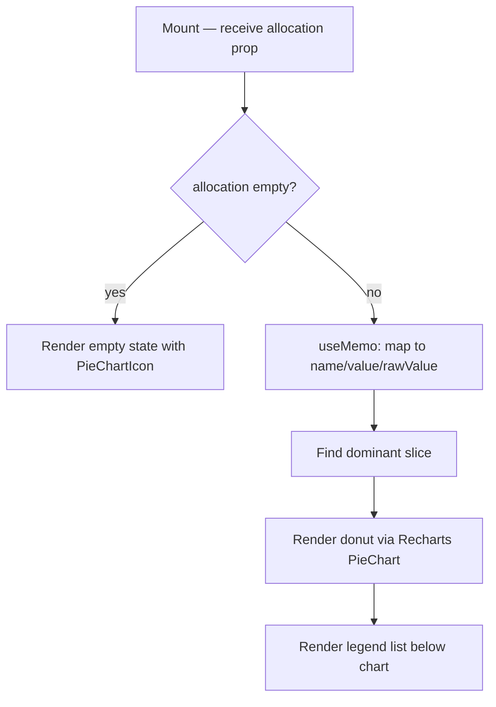

## Purpose
Renders a donut/pie chart showing portfolio allocation by asset type on the Overview page. Uses Recharts `PieChart`. A legend list below the chart shows each slice's percentage and raw value. Wrapped in `memo` for render performance.

## Props
| Prop | Type | Required | Notes |
| :--- | :--- | :--- | :--- |
| `allocation` | `AllocationItem[]` | Yes | From `@/lib/services/overview`; each item has `asset_type`, `pct`, `value` |

## Component Tree
```
AllocationDonut (memo)
├── ResponsiveContainer
│   └── PieChart (recharts)
│       └── Pie → Cell ×N
└── Legend list (div)
```

## Data Layer

### Local State
None — derived data via `useMemo` (maps `allocation` → chart-friendly `{name, value, rawValue}`).

### React Query
Not used directly; data arrives via the `allocation` prop from the parent Overview page.

## Behavior


## Related
- Component - KpiCards
- Component - PerformanceChart
- Page - Overview
