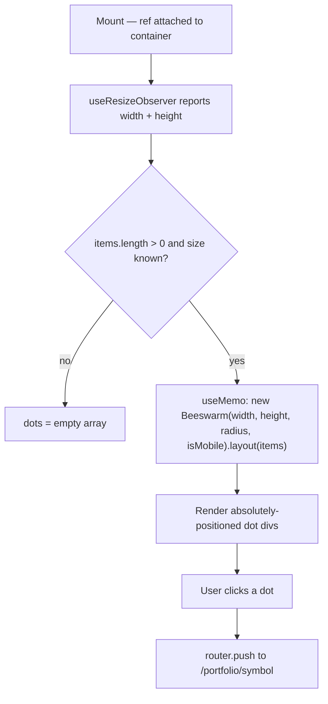

## Purpose
Renders holdings as a beeswarm scatter plot on the Portfolio page. Each holding is a circular node whose X-axis position represents P&L %, sized uniformly (mobile: radius 20, desktop: radius 40). Color is determined by `getHoldingColor`. Clicking a node navigates to the holding's detail page. Privacy mode blurs values.

## Props
| Prop | Type | Required | Notes |
| :--- | :--- | :--- | :--- |
| `items` | `PortfolioViewItem[]` | Yes | From `@/lib/visualizations/types`; each item has `symbol`, `pnlPct`, `value`, `assetType` |

## Component Tree
```
BeeswarmView
└── div (ref — resize observer, full viewport height)
    ├── Empty state (if items.length === 0)
    └── dot ×N (absolute positioned div)
        ├── TickerLogo (if radius > threshold)
        ├── symbol label
        └── pnlPct label (if radius sufficient)
```

## Data Layer

### Local State
None.

### React Query
Not used; `items` provided by Portfolio page.

## Behavior


## Related
- Component - CirclepackView
- Component - HoldingsTable
- Page - Portfolio
