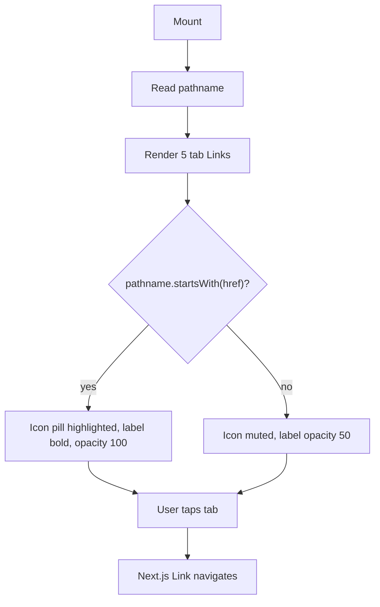

## Purpose
BottomTabBar is the mobile navigation component that mirrors a subset of the Sidebar links. It renders as a floating pill-shaped tab bar fixed near the bottom of the viewport on small screens (`md:hidden`). It exposes five primary destinations: Overview, Portfolio, Watchlist, Chat, and Settings. Active tab detection uses `pathname.startsWith(href)` to handle nested routes under each section.

## Props
This component accepts no props. Tabs are defined in the internal `tabs` constant.

## Component Tree
```
BottomTabBar
└── nav (fixed, z-50)
    └── div (glass-chrome pill)
        └── div (flex row, h-62px)
            └── Link × 5  (one per tab)
                ├── div (icon pill, highlighted if active)
                │   └── Icon (lucide)
                └── span (label text)
```

## Data Layer

### Local State — `useState`
None.

### Routing
| Hook | Purpose |
| :--- | :--- |
| `usePathname()` | Determines the active tab via `pathname.startsWith(href)` |

## Behavior


## Related
- Component - Sidebar
- Component - TopNav
