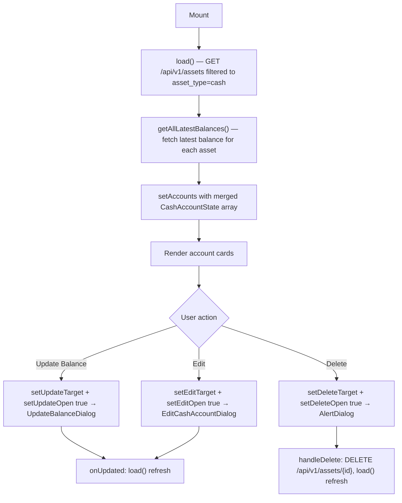

## Purpose
Self-contained section on the Portfolio page that fetches, displays, and manages all cash accounts. Renders each account as a card showing balance, currency, and optional account number (copyable). Provides inline update-balance, edit, and delete actions with confirmation dialogs.

## Props
None — fully self-contained.

## Component Tree
```
CashAccountsSection
├── Header: "Cash Accounts" + AddCashAccountDialog trigger
├── Account cards ×N
│   ├── Account name + currency badge
│   ├── Account number (copyable, if set)
│   ├── Balance + snapshot date
│   ├── "Update Balance" Button
│   ├── Edit Button → EditCashAccountDialog
│   └── Delete Button → AlertDialog
├── UpdateBalanceDialog (conditional)
├── EditCashAccountDialog (conditional)
└── AlertDialog (delete confirmation)
```

## Data Layer

### Local State
| Variable | Type | Purpose |
| :--- | :--- | :--- |
| `accounts` | `CashAccountState[]` | List of `{ asset, latest }` pairs |
| `updateTarget` | `CashAccountState \| null` | Account selected for balance update |
| `updateOpen` | `boolean` | Update-balance dialog open state |
| `editTarget` | `CashAsset \| null` | Account selected for editing |
| `editOpen` | `boolean` | Edit dialog open state |
| `deleteTarget` | `CashAsset \| null` | Account selected for deletion |
| `deleteOpen` | `boolean` | Delete confirmation dialog open state |
| `deleteLoading` | `boolean` | Delete API call in-flight |

### React Query
Not used; data loaded imperatively via `api.get("/api/v1/assets")` and `getAllLatestBalances()` in `useCallback load`.

## Behavior


## Related
- Component - AddCashAccountDialog
- Component - EditCashAccountDialog
- Page - Portfolio
