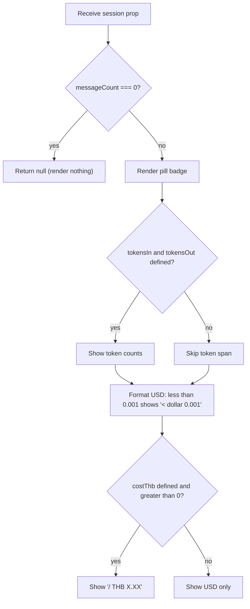

## Purpose
ChatCostBadge is a small inline display component that shows the cumulative cost and token usage for a chat session. It renders as a pill badge with a coin icon, token counts (input/output), USD cost, optional THB equivalent, and message count. It self-hides when `session.messageCount === 0`. Used on the Chat page to give users real-time cost visibility after each message.

## Props
| Prop | Type | Required | Notes |
| :--- | :--- | :--- | :--- |
| `session` | `SessionCost` | Yes | Cost and usage data for the current session |
| `className` | `string` | No | Additional Tailwind classes for layout overrides |

### `SessionCost` interface
| Field | Type | Required | Notes |
| :--- | :--- | :--- | :--- |
| `costUsd` | `number` | Yes | Total USD cost for the session |
| `costThb` | `number` | No | THB equivalent; only shown if `> 0` |
| `messageCount` | `number` | Yes | Number of messages; badge hidden when `0` |
| `tokensIn` | `number` | No | Input tokens; shown if both `tokensIn` and `tokensOut` are defined |
| `tokensOut` | `number` | No | Output tokens; shown if both `tokensIn` and `tokensOut` are defined |

## Component Tree
```
ChatCostBadge
└── div (pill badge, inline-flex)
    ├── CoinsIcon (amber)
    ├── span (token counts "up-arrow N down-arrow N ·", conditional)
    ├── span (USD cost / THB cost)
    └── span (message count "· N msg")
```

## Data Layer

### Local State — `useState`
None. Pure display component.

## Behavior


## Related
- Component - ConfirmLLMDialog
- Page - Chat
