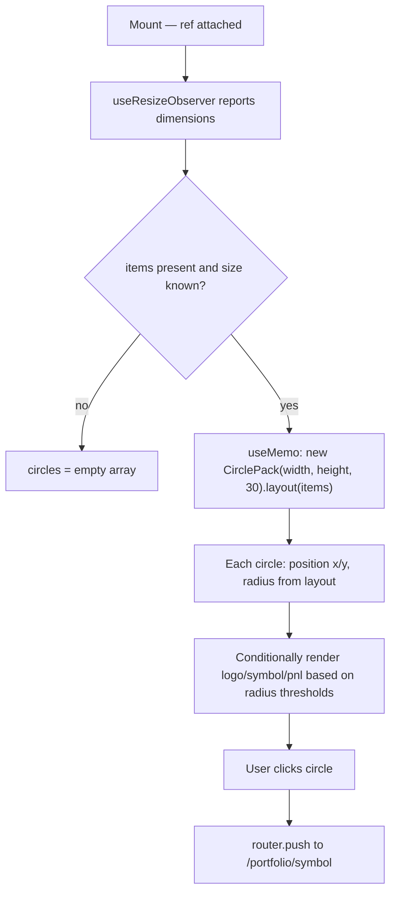

## Purpose
Renders holdings as proportional circles (circle-pack layout) on the Portfolio page. Circle area encodes holding value; color encodes P&L direction via `getHoldingColor`. Shows symbol, P&L %, and logo inside circles above a radius threshold. Clicking navigates to the holding detail page.

## Props
| Prop | Type | Required | Notes |
| :--- | :--- | :--- | :--- |
| `items` | `PortfolioViewItem[]` | Yes | From `@/lib/visualizations/types`; each has `symbol`, `pnlPct`, `value`, `assetType` |

## Component Tree
```
CirclepackView
└── div (ref — resize observer, full viewport height)
    ├── Empty state text
    └── circle div ×N (absolute positioned)
        ├── TickerLogo (radius > 32)
        ├── symbol label (radius > 28)
        └── pnlPct label (radius > 38)
```

## Data Layer

### Local State
None.

### React Query
Not used; `items` provided by Portfolio page.

## Behavior


## Related
- Component - BeeswarmView
- Component - HoldingsTable
- Page - Portfolio
