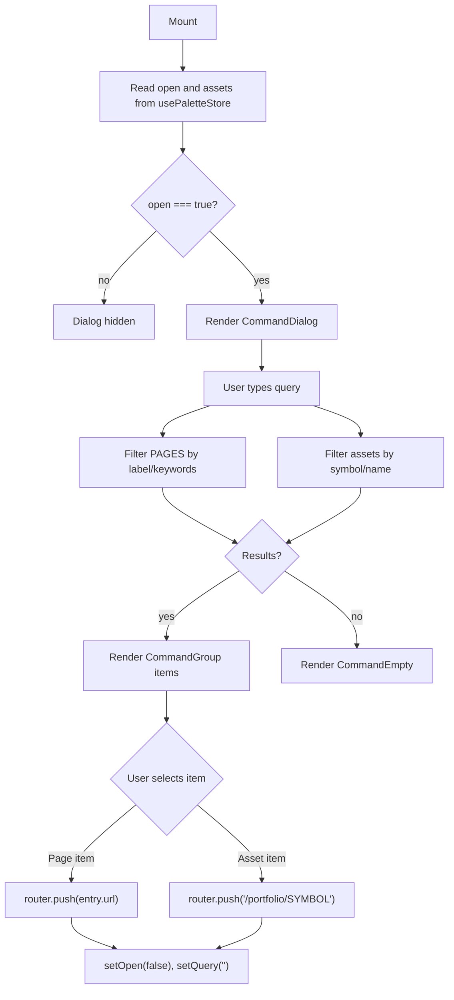

## Purpose
CommandPalette is a global keyboard-driven search dialog (triggered via the TopNav search pill or `⌘K`). It lets users quickly navigate to any page or jump to a portfolio holding. It renders two filtered groups — "Pages" (from the static `PAGES` registry) and "Holdings" (from the `usePaletteStore` assets list populated at app load). Selecting an item navigates and closes the dialog.

## Props
This component accepts no props. Open state and assets list are sourced from `usePaletteStore`.

## Component Tree
```
CommandPalette
└── CommandDialog (shadcn/ui, controlled by open/setOpen)
    ├── CommandInput (value: query, onValueChange: setQuery)
    └── CommandList
        ├── CommandEmpty (shown when no matches)
        ├── CommandGroup "Pages"
        │   └── CommandItem × N  (filteredPages)
        └── CommandGroup "Holdings"
            └── CommandItem × N  (filteredAssets)
```

## Data Layer

### Local State — `useState`
| Variable | Type | Purpose |
| :--- | :--- | :--- |
| `query` | `string` | Current search input text; drives client-side filtering |

### Zustand Store — `usePaletteStore`
| Value | Purpose |
| :--- | :--- |
| `open` | Controls dialog visibility |
| `setOpen` | Opens/closes the dialog |
| `assets` | Portfolio holdings list (symbol + name) for the Holdings group |

### Static Data
| Source | Purpose |
| :--- | :--- |
| `PAGES` from `@/lib/search/pages` | Static registry of all navigable pages with labels and keywords |

## Behavior


## Related
- Component - TopNav
- Component - Sidebar
