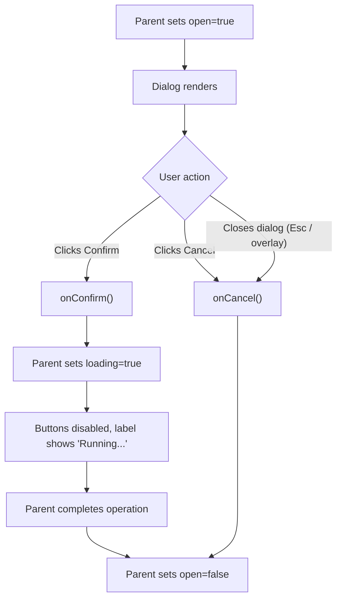

## Purpose
ConfirmLLMDialog is a controlled modal dialog that gates any AI analysis action behind an explicit user confirmation step. It displays the estimated cost, an optional model name, a customisable title/description, and two actions: Cancel and Confirm. Used on pages that trigger LLM calls (Events, Watchlist) to prevent accidental costly API calls and to make the model and cost transparent before execution.

## Props
| Prop | Type | Required | Notes |
| :--- | :--- | :--- | :--- |
| `open` | `boolean` | Yes | Controls dialog visibility |
| `onConfirm` | `() => void` | Yes | Called when the user clicks "Confirm and Run" |
| `onCancel` | `() => void` | Yes | Called when the user clicks Cancel or closes the dialog |
| `title` | `string` | No | Dialog heading; defaults to `"Run AI Analysis"` |
| `description` | `string` | No | Optional subtitle below the heading |
| `estimatedCost` | `string` | Yes | Pre-formatted cost string displayed in the cost panel |
| `model` | `string` | No | Model identifier shown as monospace code in the cost panel |
| `loading` | `boolean` | No | Disables both buttons and changes Confirm label to `"Running..."` |

## Component Tree
```
ConfirmLLMDialog
└── Dialog (controlled by open / onOpenChange → onCancel)
    └── DialogContent (max-w-sm)
        ├── DialogHeader
        │   ├── DialogTitle (ZapIcon + title)
        │   └── DialogDescription (conditional)
        ├── div (cost panel)
        │   ├── CoinsIcon (amber)
        │   ├── div (label + estimatedCost)
        │   └── code (model, conditional)
        └── DialogFooter
            ├── Button "Cancel" (variant: outline)
            └── Button "Confirm and Run" (ZapIcon + label)
```

## Data Layer

### Local State — `useState`
None. Fully controlled by parent via `open`, `onConfirm`, and `onCancel`.

## Behavior


## Related
- Component - ChatCostBadge
- Page - Events
- Page - Watchlist
