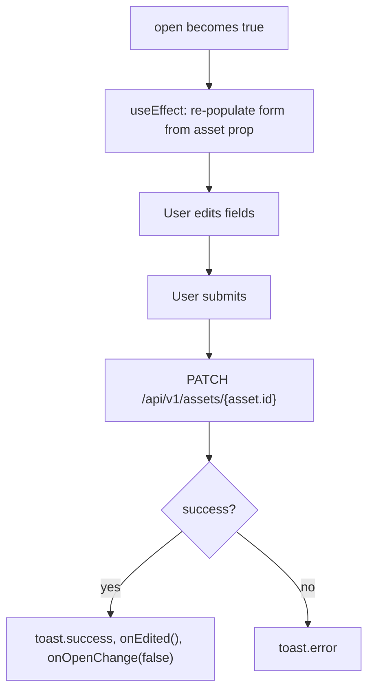

## Purpose
Controlled modal dialog for editing a cash account's name (symbol), currency, and optional account number. Calls `PATCH /api/v1/assets/{id}` on submit and fires `onEdited` so the parent refreshes.

## Props
| Prop | Type | Required | Notes |
| :--- | :--- | :--- | :--- |
| `asset` | `CashAsset` | Yes | `{ id, symbol, currency, metadata_?: { account_number? } }` |
| `open` | `boolean` | Yes | Controls dialog visibility |
| `onOpenChange` | `(v: boolean) => void` | Yes | Passed to Dialog's `onOpenChange` |
| `onEdited` | `() => void` | Yes | Callback fired after successful save |

## Component Tree
```
EditCashAccountDialog
└── Dialog (controlled)
    └── DialogContent
        └── form
            ├── Input (symbol — account name)
            ├── Select (currency)
            ├── Input (accountNumber — optional)
            └── Submit Button
```

## Data Layer

### Local State
| Variable | Type | Purpose |
| :--- | :--- | :--- |
| `symbol` | `string` | Initialised from `asset.symbol` |
| `currency` | `string` | Initialised from `asset.currency` |
| `accountNumber` | `string` | Initialised from `asset.metadata_?.account_number` |
| `loading` | `boolean` | Submission in-flight |

### React Query
Not used; calls `api.patch("/api/v1/assets/{asset.id}", ...)` imperatively.

## Behavior


## Related
- Component - AddCashAccountDialog
- Component - CashAccountsSection
- Page - Portfolio
