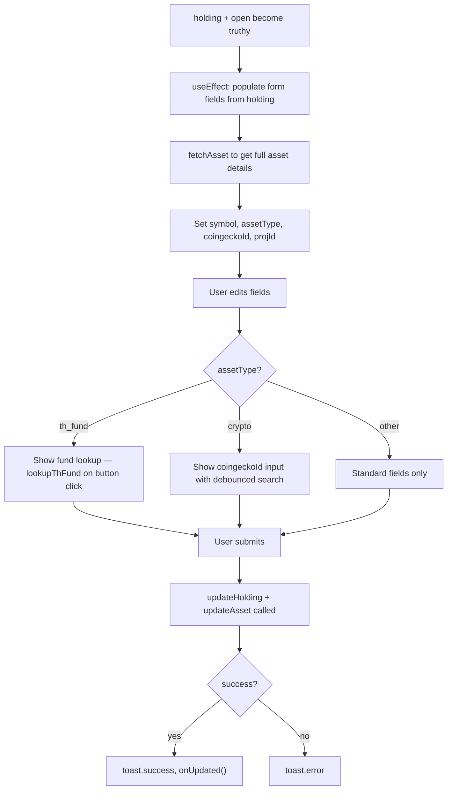

## Purpose
Controlled modal dialog for editing an existing holding's quantity, cost per share, currency, platform, and underlying asset metadata. Supports asset-type-specific extra fields: Thai funds get a fund lookup (`lookupThFund`), crypto gets a CoinGecko ID search. Calls `onUpdated` on success.

## Props
| Prop | Type | Required | Notes |
| :--- | :--- | :--- | :--- |
| `holding` | `HoldingRow \| null` | Yes | Currently selected holding row; `null` = dialog closed |
| `open` | `boolean` | Yes | Controls dialog visibility |
| `onOpenChange` | `(open: boolean) => void` | Yes | Passed to Dialog's `onOpenChange` |
| `onUpdated` | `() => void` | Yes | Callback fired after successful update |

## Component Tree
```
EditHoldingDialog
└── Dialog (controlled via open/onOpenChange)
    └── DialogContent
        └── form
            ├── Input (quantity / outstanding_shares)
            ├── Input (costPerShare)
            ├── Input (currency)
            ├── Input (platform)
            ├── [th_fund] fund lookup Input + results
            ├── [crypto] coingeckoId Input + results
            └── Submit Button
```

## Data Layer

### Local State
| Variable | Type | Purpose |
| :--- | :--- | :--- |
| `quantity` | `string` | Outstanding shares |
| `costPerShare` | `string` | Cost per share |
| `currency` | `string` | Currency code |
| `platform` | `string` | Broker/platform name |
| `loading` | `boolean` | Submission in-flight |
| `symbol` | `string` | Asset symbol |
| `assetType` | `string` | Determines extra fields shown |
| `coingeckoId` | `string` | Crypto: CoinGecko ID |
| `coinResults` | `CoinGeckoResult[]` | Crypto: autocomplete results |
| `projId` | `string` | Thai fund: SEC project ID |
| `lookupResults` | `ThFundMatch[]` | Thai fund: lookup matches |
| `lookupLoading` | `boolean` | Thai fund lookup in-flight |
| `assetLoading` | `boolean` | Fetching asset details on open |

### React Query
Not used; all fetches are imperative (`fetchAsset`, `updateHolding`, `updateAsset`, `lookupThFund`, `searchCoinGecko`).

## Behavior


## Related
- Component - AddHoldingDialog
- Component - HoldingsTable
- Page - Portfolio
