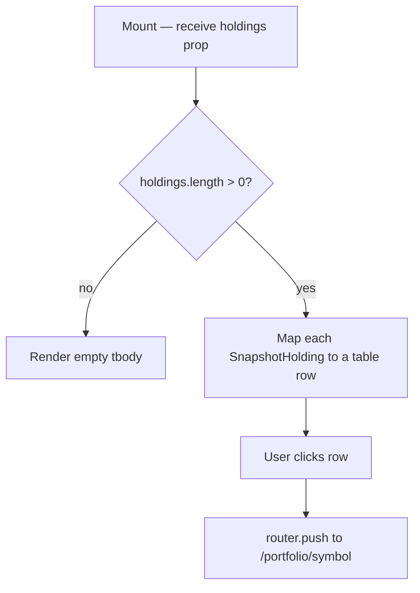

## Purpose
Renders a compact, scrollable table of top holdings on the Overview page, showing symbol, asset type, quantity, current value (dual currency), cost basis, and P&L %. Each row is clickable and navigates to the holding's detail page.

## Props
| Prop | Type | Required | Notes |
| :--- | :--- | :--- | :--- |
| `holdings` | `SnapshotHolding[]` | Yes | Array with `symbol`, `asset_type`, `quantity`, `current_value`, `cost_basis`, `pnl_pct` |

## Component Tree
```
HoldingsSnapshot
└── table (overflow-x-auto)
    ├── thead (Symbol / Type / Qty / Value / Cost Basis / P&L%)
    └── tbody
        └── tr ×N (clickable → router.push)
            └── DualCurrencyAmount (value, cost_basis)
```

## Data Layer

### Local State
None — purely presentational.

### React Query
Not used; data provided by parent Overview page.

## Behavior


## Related
- Component - KpiCards
- Component - AllocationDonut
- Page - Overview
- Page - Portfolio Detail
