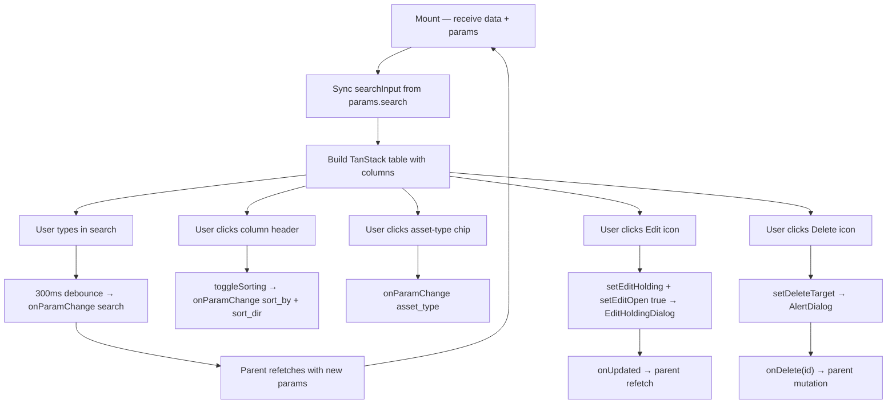

## Purpose
Feature-rich, server-side-sortable holdings table on the Portfolio page. Built on TanStack Table (`@tanstack/react-table`). Columns: Symbol (with platform color swatch + link), Asset Type filter chips, Shares, Cost/Share, Total Cost, Current Price, Current Value, P&L %. Supports search (debounced 300ms → URL param), asset-type filter tabs, sort by any numeric column, inline edit (opens `EditHoldingDialog`), and delete (AlertDialog confirmation).

## Props
| Prop | Type | Required | Notes |
| :--- | :--- | :--- | :--- |
| `data` | `HoldingRow[]` | Yes | Array of holding rows from the API |
| `params` | `HoldingsParams` | Yes | URL-synced params: `search`, `asset_type`, `sort_by`, `sort_dir`, `page` |
| `onParamChange` | `(p: Partial<HoldingsParams>) => void` | Yes | Updates URL params from table interactions |
| `onDelete` | `(id: string) => void` | Yes | Triggers delete mutation in parent |
| `onUpdated` | `() => void` | Yes | Callback after edit dialog saves |
| `isFetching` | `boolean` | No | Shows loading overlay when `true` (default: `false`) |
| `platformColors` | `Record<string, string>` | No | Map of platform name → hex color for swatches |

## Component Tree
```
HoldingsTable
├── Search Input (debounced)
├── Asset Type filter chips (us_stock / thai_stock / crypto / etf / bond / fund)
├── Table (TanStack)
│   ├── thead → sortable column headers
│   └── tbody
│       └── tr ×N
│           ├── Symbol cell (Link to /portfolio/symbol, platform color dot)
│           ├── DualCurrencyAmount cells (cost, value)
│           └── Action buttons (Edit / Delete)
├── EditHoldingDialog (controlled)
└── AlertDialog (delete confirmation)
```

## Data Layer

### Local State
| Variable | Type | Purpose |
| :--- | :--- | :--- |
| `sorting` | `SortingState` | TanStack table sort state |
| `searchInput` | `string` | Local search value (debounced before URL sync) |
| `editHolding` | `HoldingRow \| null` | Row selected for editing |
| `editOpen` | `boolean` | Edit dialog open state |
| `deleteTarget` | `HoldingRow \| null` | Row selected for deletion |

### React Query
Not used directly; data and mutations are managed by the parent Portfolio page and passed via props.

## Behavior


## Related
- Component - EditHoldingDialog
- Component - AddHoldingDialog
- Component - BeeswarmView
- Component - CirclepackView
- Page - Portfolio
