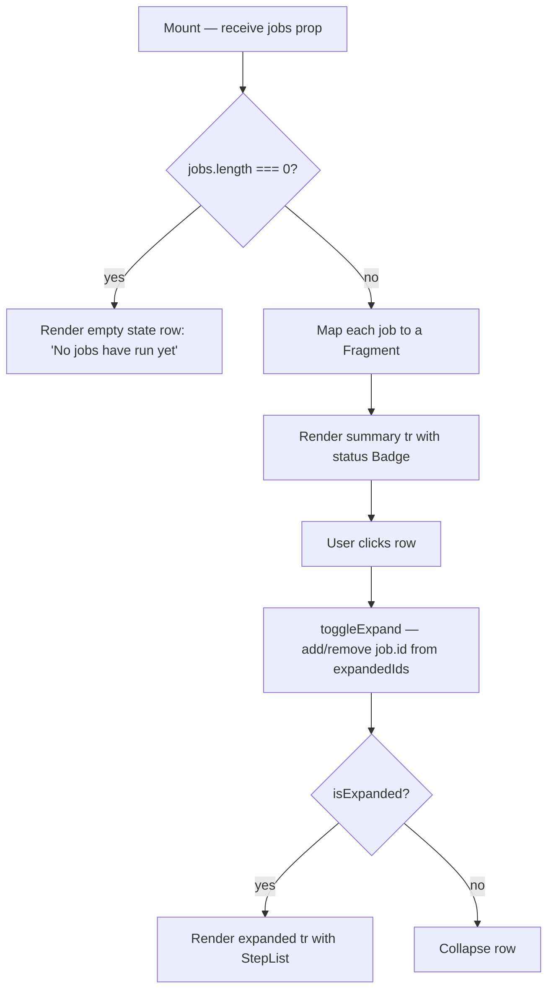

## Purpose
Renders a sortable, expandable table of pipeline job runs on the Pipeline page. Each row shows job type (human-readable label), status badge, start time, and duration. Clicking a row expands it to reveal the `StepList` sub-component showing per-step details. Failed jobs show a summary error notice below the table.

## Props
| Prop | Type | Required | Notes |
| :--- | :--- | :--- | :--- |
| `jobs` | `PipelineJob[]` | Yes | From `@/lib/services/pipeline`; fields include `id`, `job_type`, `status`, `started_at`, `finished_at`, `steps` |

## Component Tree
```
JobsTable
└── Card
    ├── CardHeader (title: "Pipeline Jobs")
    └── CardContent
        └── table
            ├── thead (Job / Status / Started / Duration)
            └── tbody
                └── Fragment ×N
                    ├── tr (summary row — clickable)
                    │   ├── expand toggle "▴"/"▾"
                    │   ├── job label
                    │   ├── Badge (status)
                    │   ├── started_at
                    │   └── duration
                    └── tr (expanded — conditional)
                        └── StepList
```

## Data Layer

### Local State
| Variable | Type | Purpose |
| :--- | :--- | :--- |
| `expandedIds` | `Set<string>` | Tracks which job rows are expanded |

### React Query
Not used; `jobs` array is fetched by the parent Pipeline page and passed as props.

## Behavior


## Related
- Component - StepList
- Component - TriggerButtons
- Page - Pipeline
