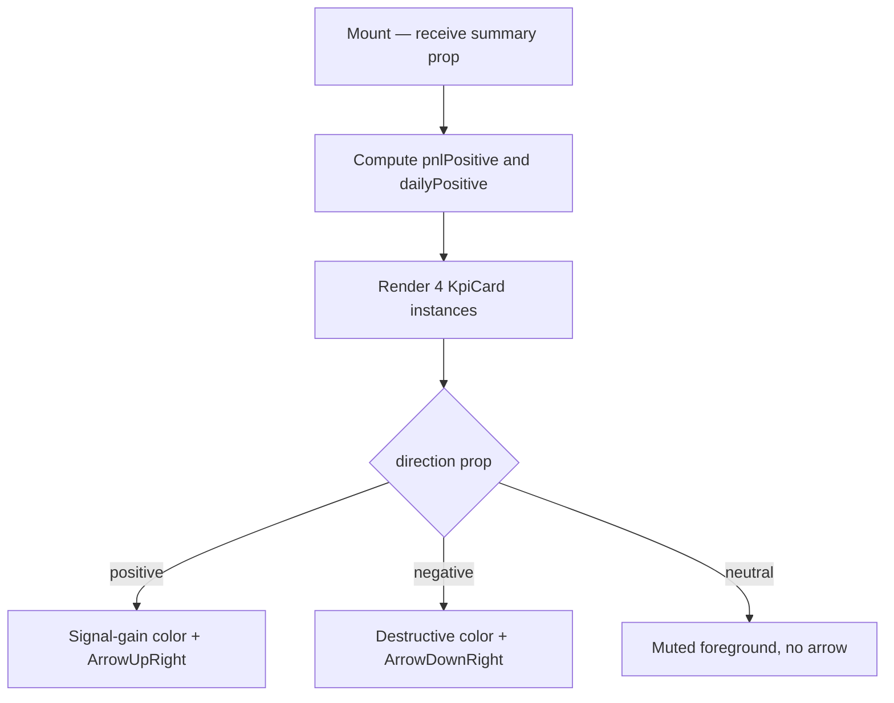

## Purpose
Renders four KPI metric cards (Portfolio Value, Daily Change, Total P&L, Daily Change %) in a responsive 2×4 grid on the Overview page. Each card shows a primary value via `DualCurrencyAmount` and an optional percentage badge with directional coloring.

## Props
| Prop | Type | Required | Notes |
| :--- | :--- | :--- | :--- |
| `summary` | `OverviewSummary` | Yes | From `@/lib/services/overview`; fields: `total_value`, `total_cost`, `total_pnl`, `daily_change`, `total_pnl_pct`, `daily_change_pct` |

## Component Tree
```
KpiCards
└── KpiCard ×4 (internal)
    ├── DualCurrencyAmount
    └── ArrowUpRight / ArrowDownRight
```

## Data Layer

### Local State
None — purely presentational.

### React Query
Not used directly; data arrives via the `summary` prop, fetched by the parent Overview page.

## Behavior


## Related
- Component - SummaryBar
- Component - PerformanceChart
- Page - Overview
