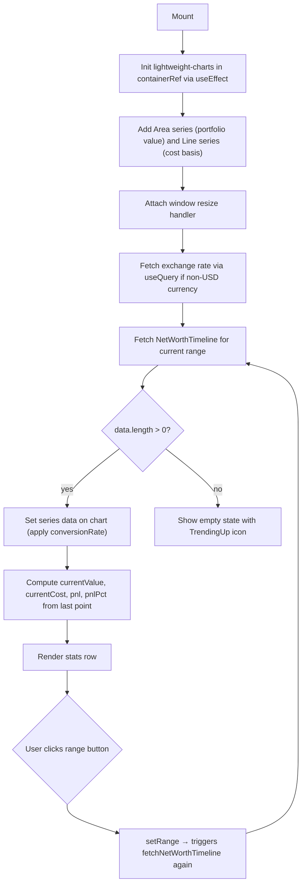

## Purpose
NetWorthChart renders an interactive time-series chart of the user's net worth (portfolio value vs. total cost basis) using the `lightweight-charts` library. It supports five time ranges (1M, 3M, 6M, 1Y, ALL), displays Current Value, Total Cost, and Unrealized PnL as summary stats, and respects both privacy mode (blurs numbers) and the user's primary currency (converts USD values via exchange rate). Used on the Net Worth page, Overview page, and root page.

## Props
| Prop | Type | Required | Notes |
| :--- | :--- | :--- | :--- |
| `privacyMode` | `boolean` | Yes | When `true`, replaces all numeric values with `"****** {currency}"` |

## Component Tree
```
NetWorthChart
└── Card
    ├── CardHeader
    │   ├── div (title row)
    │   │   ├── CardTitle "Net Worth"
    │   │   └── div (range buttons: 1M / 3M / 6M / 1Y / ALL)
    │   └── div (stats row)
    │       ├── div "Current Value"
    │       ├── div "Total Cost"
    │       └── div "Unrealized PnL"
    └── CardContent
        └── div (h-64 relative)
            ├── div (containerRef — lightweight-charts mounts here)
            ├── div "Loading..." (conditional)
            └── div "No net worth data yet" + TrendingUp icon (conditional)
```

## Data Layer

### Local State — `useState`
| Variable | Type | Purpose |
| :--- | :--- | :--- |
| `range` | `Range` ("1M" \| "3M" \| "6M" \| "1Y" \| "ALL") | Currently selected time range |
| `data` | `NetWorthPoint[]` | Timeline data points fetched for the selected range |
| `loading` | `boolean` | True while fetching range data |

### Refs
| Ref | Type | Purpose |
| :--- | :--- | :--- |
| `containerRef` | `HTMLDivElement` | DOM target where lightweight-charts mounts the canvas |
| `chartRef` | `IChartApi` | Chart instance for resize and cleanup |
| `valueSeriesRef` | `ISeriesApi<"Area">` | Portfolio value area series |
| `costSeriesRef` | `ISeriesApi<"Line">` | Cost basis dashed line series |

### useQuery (TanStack Query)
| Query Key | Fetcher | Purpose |
| :--- | :--- | :--- |
| `["exchange-rate", "USD", primaryCurrency]` | `fetchExchangeRate` | Fetches USD-to-primary-currency rate; skipped if `primaryCurrency === "USD"` |

### Direct Fetch (imperative, in useEffect)
| Function | Trigger |
| :--- | :--- |
| `fetchNetWorthTimeline(range)` | On mount and whenever `range` or `conversionRate` changes |

## Behavior


## Related
- Page - Net Worth
- Page - Overview
- Page - Root
