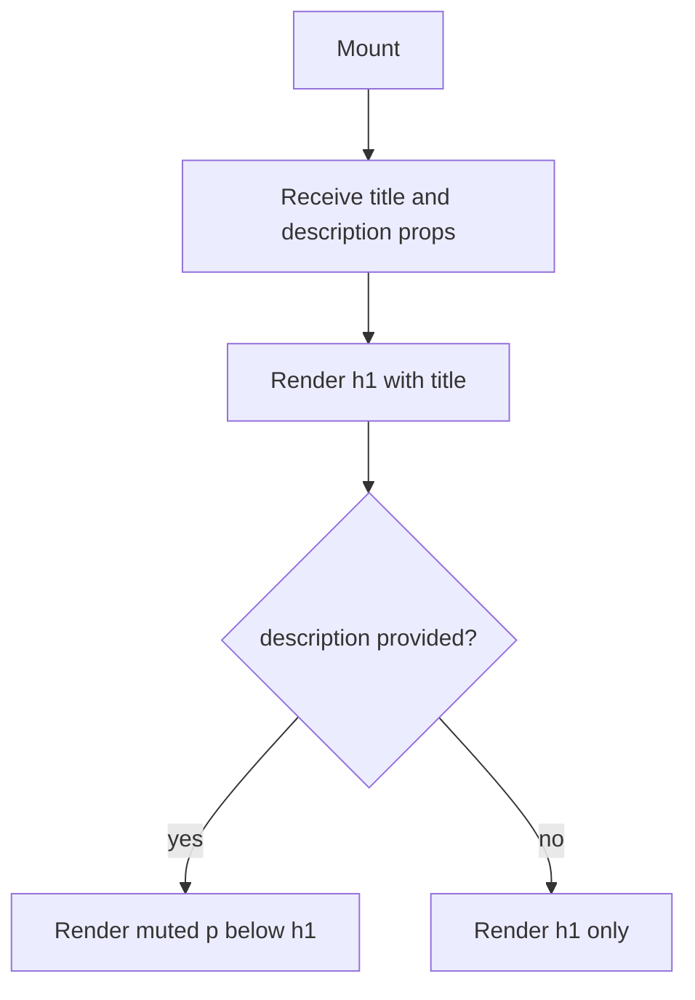

## Purpose
PageHeader is a simple, stateless presentational component that renders a consistent page-level heading. It outputs an `h1` title and an optional muted description paragraph, wrapped in a `div` with bottom margin. It is used at the top of content pages to establish visual hierarchy without requiring each page to re-implement heading styles.

## Props
| Prop | Type | Required | Notes |
| :--- | :--- | :--- | :--- |
| `title` | `string` | Yes | Main page heading rendered as `h1` |
| `description` | `string` | No | Subtitle rendered as muted small text below the title |

## Component Tree
```
PageHeader
└── div (mb-6)
    ├── h1 (title)
    └── p (description, conditional)
```

## Data Layer

### Local State — `useState`
None.

## Behavior


## Related
- Page - Overview
- Page - Portfolio
- Page - Import
- Page - Settings
