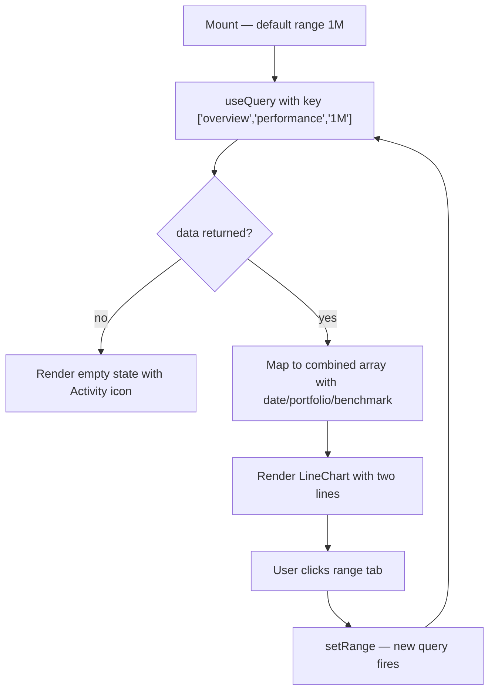

## Purpose
Renders a dual-line chart comparing portfolio performance vs. S&P 500 benchmark over a selectable time range (1W, 1M, 3M, 1Y) on the Overview page. Wrapped in `memo`.

## Props
None — self-contained; fetches its own data via React Query.

## Component Tree
```
PerformanceChart (memo)
├── Tabs (range selector: 1W / 1M / 3M / 1Y)
└── ResponsiveContainer
    └── LineChart (recharts)
        ├── XAxis (date)
        ├── YAxis
        ├── Tooltip
        ├── Legend
        ├── Line (portfolio — indigo)
        └── Line (benchmark S&P500 — slate dashed)
```

## Data Layer

### Local State
| Variable | Type | Purpose |
| :--- | :--- | :--- |
| `range` | `"1W" \| "1M" \| "3M" \| "1Y"` | Currently selected time range tab |

### React Query
| Query key | Endpoint | Purpose |
| :--- | :--- | :--- |
| `["overview", "performance", range]` | `fetchPerformance(range)` → `GET /api/v1/overview/performance?range={range}` | Fetches portfolio + benchmark timeseries |

## Behavior


## Related
- Component - KpiCards
- Component - AllocationDonut
- Page - Overview
