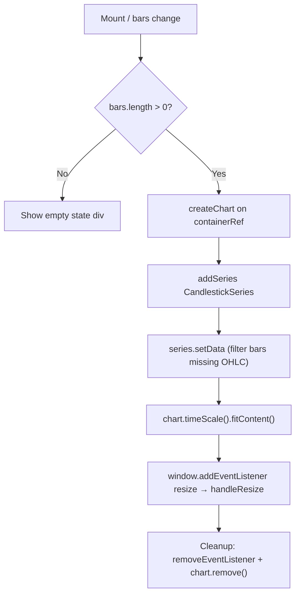

## Purpose
Renders a candlestick price chart for a single asset using the `lightweight-charts` library. Mounts and destroys the chart imperatively inside a `useEffect`. Shows an empty state when no price data is available.

## Usage

```tsx
<PriceChart bars={priceBars} />
```

Used in: Page - Portfolio Detail

## Props Interface

```typescript
interface Props {
  bars: PriceBar[];
}
```

| Prop | Type | Required | Default | Purpose |
| :--- | :--- | :--- | :--- | :--- |
| `bars` | `PriceBar[]` | Yes | — | OHLC bars from the asset history API |

## State

No local state. Chart instance is managed imperatively via `containerRef`.

## Lifecycle



## Chart Configuration

| Setting | Value |
| :--- | :--- |
| Background | Transparent |
| Text color | `#94a3b8` (slate-400) |
| Grid lines | Hidden |
| Height | 300px |
| Up candle | `#10b981` (emerald-500) |
| Down candle | `#f43f5e` (rose-500) |

## Data Filtering

Bars are filtered before setting data: `bars.filter(b => b.open && b.high && b.low)`. Bars with missing OHLC values (e.g. partial data from the price pipeline) are excluded to avoid `lightweight-charts` render errors.

## Render Conditions

| Condition | What renders |
| :--- | :--- |
| `bars.length === 0` | "No price data available yet." centered text |
| `bars.length > 0` | `<div ref={containerRef}>` — chart renders into this |

## Related

| Role | Link |
| :--- | :--- |
| Page | Page - Portfolio Detail |
| DB | DB - prices |
