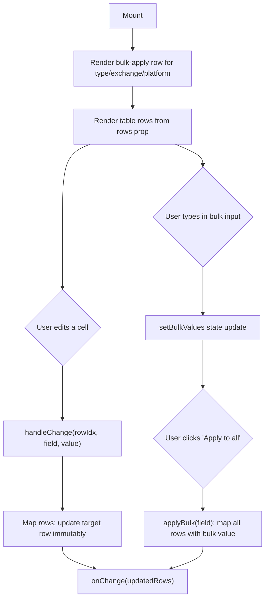

## Purpose
ReviewTable renders an editable spreadsheet-style table for reviewing and correcting parsed trade rows before they are imported. Each cell in the table is an inline `<input>` so the user can fix any field. A "bulk apply" row at the top allows applying a single value across all rows for categorical fields (`type`, `exchange`, `platform`). Required fields are visually flagged. The component is controlled — all mutations flow up to the parent via `onChange`. Used on the Import page.

## Props
| Prop | Type | Required | Notes |
| :--- | :--- | :--- | :--- |
| `rows` | `CanonicalRow[]` | Yes | Array of parsed trade rows to display and edit |
| `onChange` | `(rows: CanonicalRow[]) => void` | Yes | Called with the full updated rows array on any cell or bulk edit |

### Internal constants
| Constant | Purpose |
| :--- | :--- |
| `REQUIRED_FIELDS` | Fields highlighted as mandatory (`trade_date`, `type`, `symbol`, ...) |
| `BULK_APPLY_FIELDS` | Fields that support bulk-apply: `type`, `exchange`, `platform` |
| `VISIBLE_FIELDS` | Ordered list of all 15 columns rendered in the table |

## Component Tree
```
ReviewTable
└── div
    ├── div (bulk-apply row)
    │   └── [for each BULK_APPLY_FIELDS]
    │       ├── Input (bulk value entry)
    │       └── button "Apply to all"
    └── Table
        ├── TableHeader
        │   └── TableRow
        │       └── TableHead × 15 (VISIBLE_FIELDS)
        └── TableBody
            └── TableRow × N (one per row)
                └── TableCell × 15
                    └── Input (editable cell)
```

## Data Layer

### Local State — `useState`
| Variable | Type | Purpose |
| :--- | :--- | :--- |
| `bulkValues` | `Record<string, string>` | Holds the bulk-apply input value for each `BULK_APPLY_FIELDS` field |

## Behavior


## Related
- Page - Import
