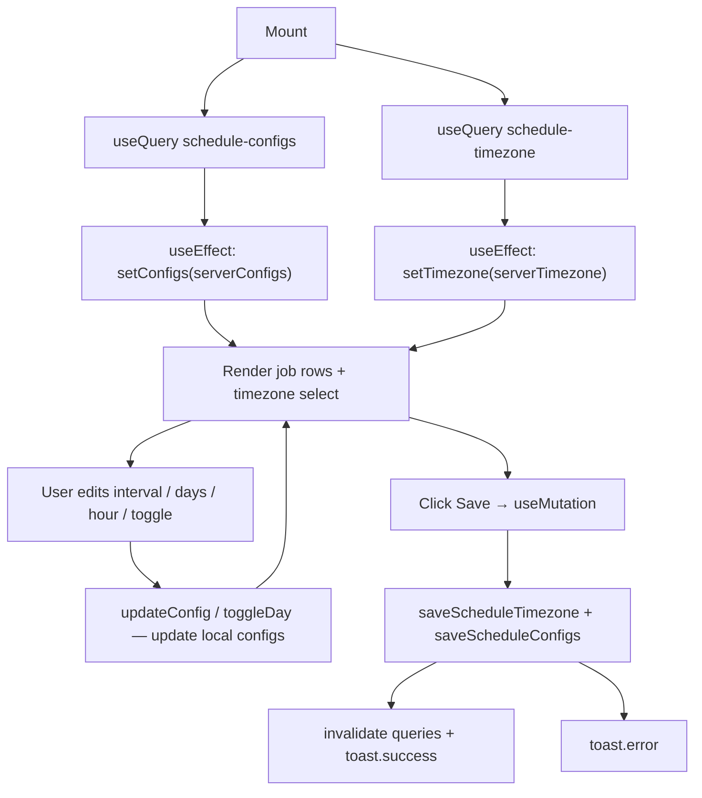

## Purpose
Settings tab for configuring the price-fetch job schedule. Each asset class (US Stock, Thai Stock, Thai Fund, Crypto, Gold, Benchmark) can be independently enabled/disabled, given a fetch interval, a start hour, and a set of active days. All settings plus the global timezone are saved in one action via a single API call.

## Usage

```tsx
<ScheduleTab />
```

Used in: Page - Settings (as the "Schedule" tab)

## Props Interface

No props — self-contained component.

## State

### Local State — `useState`

| Variable | Type | Initial | Purpose |
| :--- | :--- | :--- | :--- |
| `configs` | `ScheduleConfig[]` | `[]` | Local editable copy of job configs (seeded from server) |
| `timezone` | `string` | `"Asia/Bangkok"` | Local editable timezone (seeded from server) |

### Server State — React Query

| Query Key | Hook | Purpose |
| :--- | :--- | :--- |
| `["schedule-configs"]` | `useQuery` | Fetches all job schedule configs |
| `["schedule-timezone"]` | `useQuery` | Fetches currently saved timezone |

### Mutations

`useMutation` — saves timezone + all configs atomically via `saveScheduleTimezone` + `saveScheduleConfigs`. On success, invalidates both query keys and shows a `sonner` toast.

## Component Tree

```
ScheduleTab
└── div.space-y-6
    ├── div (card with divide-y rows)
    │   ├── "Timezone" row → Select (15 timezone options)
    │   └── ordered.map → job config row
    │       ├── Label + Switch (enabled toggle)
    │       ├── Select (interval: once / 15 / 30 / 60 / 120 min)
    │       ├── Select (start hour: 00:00–23:00)
    │       └── day buttons × 7 (Mon–Sun toggle)
    └── Button "Save Schedule"
```

## Job Order

`JOB_ORDER = ["us_stock", "thai_stock", "thai_fund", "crypto", "gold", "benchmark"]`

Configs are reordered to match this sequence regardless of server response order.

## Lifecycle



## Events & Handlers

| Event | Handler | What it does |
| :--- | :--- | :--- |
| Switch toggle | `updateConfig(jobKey, {enabled})` | Flips enabled flag in local `configs` |
| Interval select | `updateConfig(jobKey, {interval_minutes})` | Sets minutes (`null` = once) |
| Hour select | `updateConfig(jobKey, {run_at_hour})` | Sets 0–23 hour |
| Day button click | `toggleDay(jobKey, day)` | Adds or removes day index from `days` array, keeps sorted |
| Timezone select | `setTimezone(tz)` | Updates local timezone string |
| "Save Schedule" click | `saveConfigs()` | Fires mutation |

## Interval Mapping

| Select value | `interval_minutes` stored |
| :--- | :--- |
| `"once"` | `null` |
| `"15"` | `15` |
| `"30"` | `30` |
| `"60"` | `60` |
| `"120"` | `120` |

## Render Conditions

| Condition | What renders |
| :--- | :--- |
| `configsLoading \|\| tzLoading` | "Loading schedule…" text |
| Normal | Full schedule UI |

## Related

| Role | Link |
| :--- | :--- |
| Page | Page - Settings |
| DB | DB - price_schedule_config |
