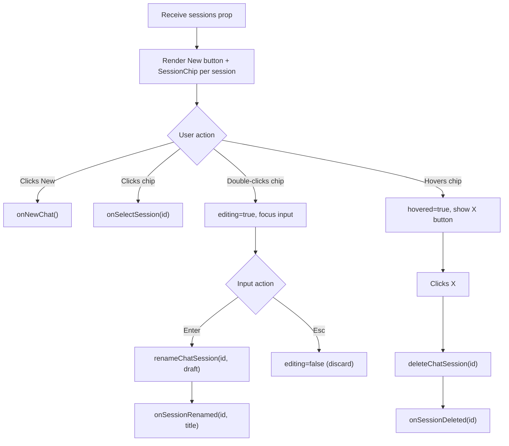

## Purpose
SessionStrip is a horizontally scrollable row of chat session chips displayed above the chat message area. It allows the user to switch between existing conversations, start a new one, rename a session (double-click on the chip), or delete a session (hover reveals an X button). Rename and delete operations call the API directly via `renameChatSession` and `deleteChatSession`, then propagate the result up via callbacks. Used exclusively on the Chat page.

## Props
| Prop | Type | Required | Notes |
| :--- | :--- | :--- | :--- |
| `sessions` | `ChatSessionSummary[]` | Yes | List of chat sessions to display as chips |
| `activeSessionId` | `string \| null` | Yes | ID of the currently selected session; controls chip highlight |
| `onSelectSession` | `(id: string) => void` | Yes | Called when the user clicks a session chip |
| `onNewChat` | `() => void` | Yes | Called when the user clicks the "New" button |
| `onSessionRenamed` | `(id: string, title: string) => void` | Yes | Called after a successful rename API call |
| `onSessionDeleted` | `(id: string) => void` | Yes | Called after a successful delete API call |

## Component Tree
```
SessionStrip
└── div (scrollable flex row, border-b)
    ├── button "New" (PlusIcon)
    └── SessionChip × N
        ├── [editing=false] button (session title, double-click to rename)
        │   └── button (XIcon delete, visible on hover)
        └── [editing=true] input (draft title, Enter to save, Esc to cancel)
```

`SessionChip` is a private sub-component managing per-chip edit/hover state.

## Data Layer

### Local State — `useState` (in `SessionChip`)
| Variable | Type | Purpose |
| :--- | :--- | :--- |
| `editing` | `boolean` | Whether the chip is in inline rename edit mode |
| `draft` | `string` | Current value of the rename input field |
| `hovered` | `boolean` | Whether the chip is hovered (shows delete X button) |

### API Calls (in `SessionStrip`)
| Function | Trigger | Effect |
| :--- | :--- | :--- |
| `renameChatSession(id, title)` | Save confirmed in `SessionChip` | Renames session on server, then calls `onSessionRenamed` |
| `deleteChatSession(id)` | Delete X clicked | Deletes session on server, then calls `onSessionDeleted` |

## Behavior


## Related
- Page - Chat
