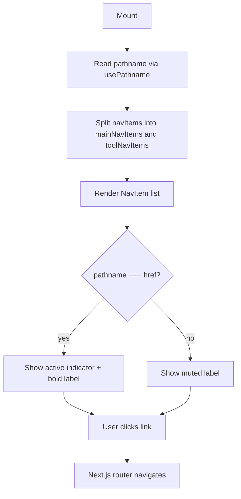

## Purpose
Sidebar is the primary desktop navigation shell for authenticated users. It renders a fixed left-side panel (hidden on mobile, visible on `md+`) containing a logo area and two grouped navigation sections — "Portfolio" (Overview, Portfolio, Watchlist, Chat, Net Worth) and "Tools" (Analysis, Transactions, Activity, Import, Research, AI Usage, Settings, Backup). It reads the current route via `usePathname` to highlight the active item with a left-side indicator bar.

## Props
This component accepts no props. All navigation data is defined internally via the `navItems` constant.

## Component Tree
```
Sidebar
└── aside
    └── div (card shell)
        ├── div (logo area)
        └── nav
            ├── p ("Portfolio" label)
            ├── NavItem × 5  (mainNavItems — slice 0..4)
            ├── hr (divider)
            ├── p ("Tools" label)
            └── NavItem × 9  (toolNavItems — slice 5..)
```

`NavItem` is a private sub-component that renders a Next.js `Link` with an active indicator bar.

## Data Layer

### Local State — `useState`
None.

### Routing
| Hook | Purpose |
| :--- | :--- |
| `usePathname()` | Determines which `NavItem` is active via exact path match |

## Behavior


## Related
- Component - BottomTabBar
- Component - TopNav
- Component - CommandPalette
