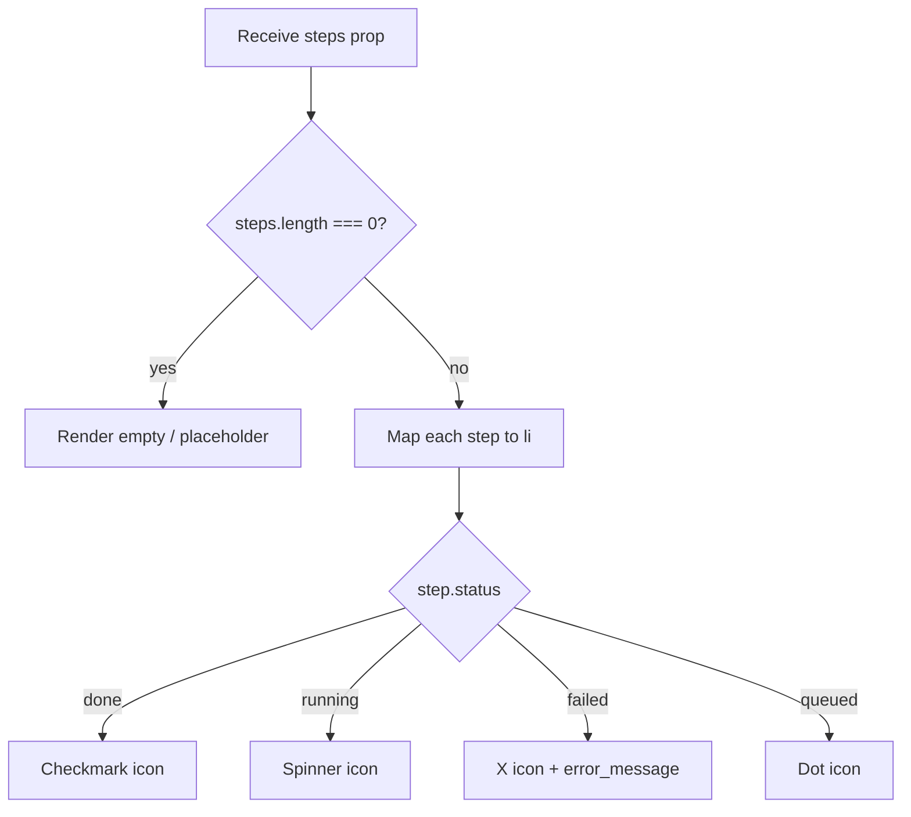

## Purpose
Renders the list of individual execution steps within a pipeline job, shown in the expanded row of `JobsTable`. Each step displays its name, status indicator, and any error message. Provides a granular view of job progress.

## Props
| Prop | Type | Required | Notes |
| :--- | :--- | :--- | :--- |
| `steps` | `PipelineStep[]` | Yes | From `@/lib/services/pipeline`; each has `name`, `status`, `error_message?`, `started_at?`, `finished_at?` |

## Component Tree
```
StepList
└── ul
    └── li ×N
        ├── Status icon (check / spinner / x / dot)
        ├── Step name label
        └── error_message (conditional — text-destructive)
```

## Data Layer

### Local State
None — purely presentational.

### React Query
Not used; `steps` arrives from `JobsTable` via `job.steps`.

## Behavior


## Related
- Component - JobsTable
- Component - TriggerButtons
- Page - Pipeline
