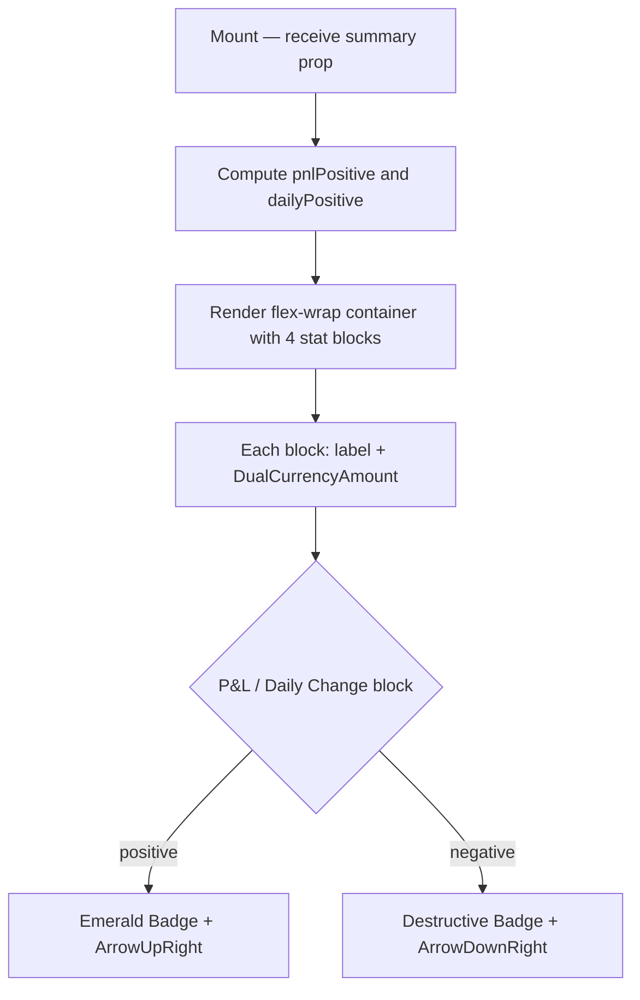

## Purpose
Renders a horizontal summary strip at the top of the Overview page with Portfolio Value (large), Total Cost, Total P&L, and Daily Change as inline stats. Uses `DualCurrencyAmount` for each value and `Badge` for directional P&L/daily-change indicators.

## Props
| Prop | Type | Required | Notes |
| :--- | :--- | :--- | :--- |
| `summary` | `OverviewSummary` | Yes | Fields: `total_value`, `total_cost`, `total_pnl`, `total_pnl_pct`, `daily_change`, `daily_change_pct` |

## Component Tree
```
SummaryBar
├── DualCurrencyAmount (Portfolio Value — text-3xl)
├── DualCurrencyAmount (Total Cost)
├── DualCurrencyAmount + Badge (Total P&L + pct)
│   └── ArrowUpRight / ArrowDownRight
└── DualCurrencyAmount + Badge (Daily Change + pct)
    └── ArrowUpRight / ArrowDownRight
```

## Data Layer

### Local State
None — purely presentational.

### React Query
Not used; data arrives via props from the parent Overview page.

## Behavior


## Related
- Component - KpiCards
- Component - PerformanceChart
- Page - Overview
