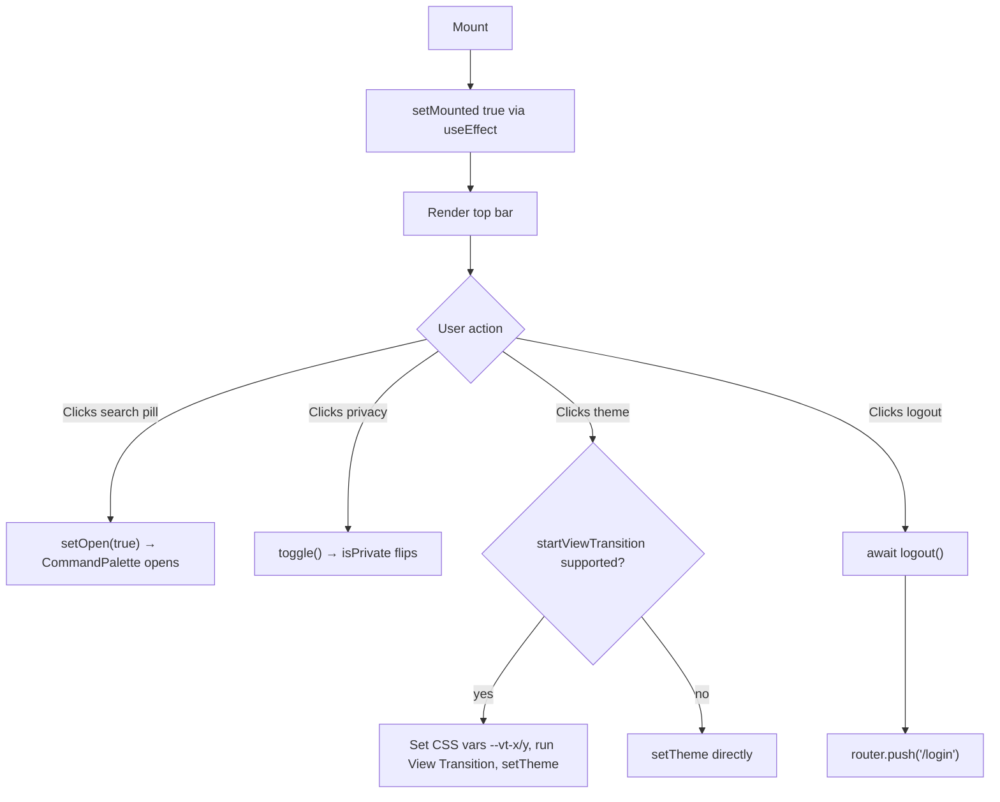

## Purpose
TopNav is the horizontal top bar rendered in the authenticated layout alongside Sidebar. It provides four global actions: opening the CommandPalette via a search pill, toggling privacy mode (hide/show sensitive values), toggling dark/light theme with a CSS View Transition animation, and logging out. It has no route-specific logic and is always visible on authenticated pages.

## Props
This component accepts no props. All state is sourced from Zustand stores and Next.js hooks.

## Component Tree
```
TopNav
└── header
    └── div (card shell)
        ├── button (search pill → opens CommandPalette)
        ├── Button (privacy toggle — Eye / EyeOff icon)
        ├── Button (theme toggle — Sun / Moon icon, ref: toggleRef)
        └── Button (logout — LogOut icon)
```

## Data Layer

### Local State — `useState`
| Variable | Type | Purpose |
| :--- | :--- | :--- |
| `mounted` | `boolean` | Guards theme icon rendering until client hydration completes (prevents SSR mismatch) |

### Zustand Stores
| Store | Consumed | Purpose |
| :--- | :--- | :--- |
| `usePrivacyStore` | `isPrivate`, `toggle` | Privacy mode state and toggle callback |
| `usePaletteStore` | `setOpen` | Opens the CommandPalette dialog |

### Other Hooks
| Hook | Purpose |
| :--- | :--- |
| `useRouter()` | Navigates to `/login` after logout |
| `useTheme()` | Reads `resolvedTheme`, calls `setTheme` to switch themes |

## Behavior


## Related
- Component - Sidebar
- Component - CommandPalette
- Component - BottomTabBar
