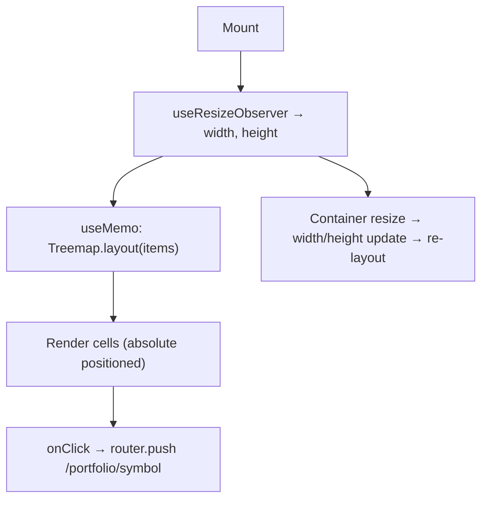

## Purpose
Treemap visualisation of portfolio holdings. Each holding is a rectangular cell sized by portfolio weight and coloured by P&L %. Cells are clickable (navigate to Portfolio Detail). Supports privacy mode (blurs values), adaptive label display based on cell size, and hover tooltips.

## Usage

```tsx
<TreemapView items={portfolioViewItems} />
```

Used in: Page - Portfolio

## Props Interface

```typescript
interface Props {
  items: PortfolioViewItem[];
}
```

| Prop | Type | Required | Default | Purpose |
| :--- | :--- | :--- | :--- | :--- |
| `items` | `PortfolioViewItem[]` | Yes | — | Normalised holding items for visualisation |

## State

No local state. Layout is derived from `items`, `width`, and `height` via `useMemo`.

### Global State — Zustand

| Store | Fields Read | Actions Called |
| :--- | :--- | :--- |
| `usePrivacyStore` | `isPrivate` | Replaces values/percentages with `••••••` |

## Component Tree

```
TreemapView
└── div ref={ref} (resize container, height: 100svh-320px, min 400px)
    ├── (empty state) — "Add holdings to see visualization"
    └── cells.map → absolute div (positioned cell)
        ├── hover overlay (bg-white/10)
        ├── hover tooltip (absolute, above cell)
        │   └── symbol / value / portfolio% / P&L%
        └── content (shown when minDim > threshold)
            ├── P&L% badge (top-right, shown when minDim > 44)
            ├── TickerLogo (shown when minDim > 48)
            ├── symbol text (shown when minDim > 28)
            └── value text (shown when minDim > 52)
```

## Layout Algorithm

`new Treemap(width, height).layout(items)` — squarified treemap from `frontend/lib/visualizations/treemap.ts`. Returns `cells: { symbol, x, y, w, h, pnlPct, displayValue, portfolioPct, logoUrl }[]`.

Layout is memoized on `[items, width, height]`. `width` and `height` come from `useResizeObserver<HTMLDivElement>()` — recalculates on container resize.

## Adaptive Label Thresholds

| `minDim` threshold | What appears |
| :--- | :--- |
| > 28px | Symbol text |
| > 44px | P&L% badge |
| > 48px | TickerLogo |
| > 52px | Value text |

Font size scales proportionally: `Math.max(10, Math.min(minDim * 0.18, 16))` for symbol, `Math.max(9, Math.min(minDim * 0.13, 12))` for value.

## Cell Colors

`getHoldingColor(pnlPct)` from `frontend/lib/visualizations/types.ts` returns `{ bg, accent }`. Applied as `linear-gradient(135deg, bg 0%, accent 100%)`. Text is always white for contrast.

## Lifecycle



## Render Conditions

| Condition | What renders |
| :--- | :--- |
| `items.length === 0` | "Add holdings to see visualization" |
| `width === 0 \|\| height === 0` | `cells = []` — nothing rendered until measured |
| `isPrivate` | Values and portfolio% replaced with `••••••` |

## Related

| Role | Link |
| :--- | :--- |
| Page | Page - Portfolio |
| Toggle | Component - PortfolioViewToggle |
| Sibling visualisation | Component - BeeswarmView |
| Sibling visualisation | Component - CirclepackView |
| Store | Store - Privacy |
