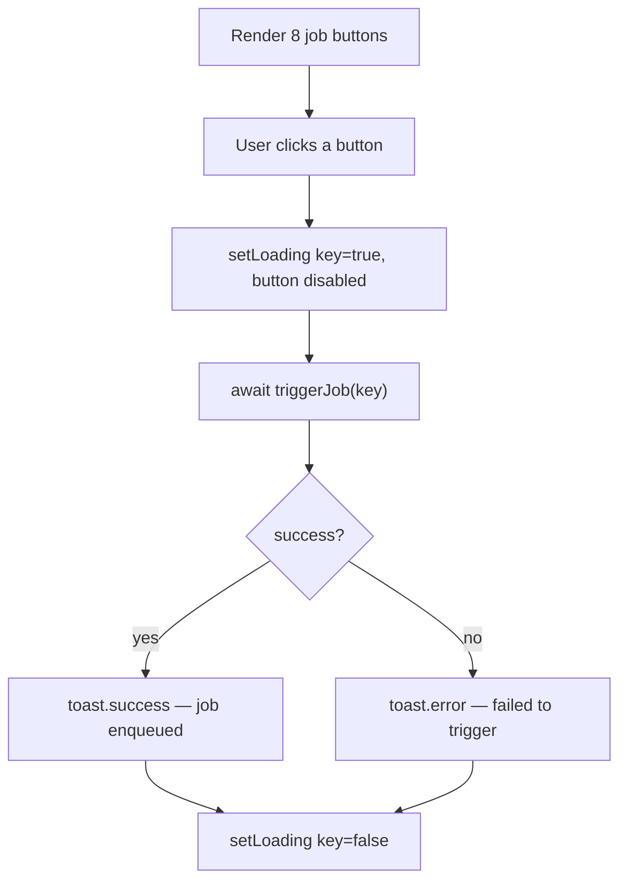

# Component - TriggerButtons

## Purpose
Renders a row of outline buttons on the Pipeline page, one per job type, allowing the user to manually enqueue pipeline jobs (price fetches, snapshots, backfills). Each button independently tracks its loading state.

## Props
None — fully self-contained; uses a hardcoded `JOBS` list.

## Component Tree
```
TriggerButtons
└── div (flex-wrap gap-2)
    └── Button ×8 (variant="outline", size="sm")
```

## Data Layer

### Local State
| Variable | Type | Purpose |
| :--- | :--- | :--- |
| `loading` | `Record<string, boolean>` | Per-job loading state keyed by `JobType` |

### React Query
Not used; calls `triggerJob(key)` imperatively from `@/lib/services/pipeline`.

## Behavior


Available jobs: `price_fetch_us`, `price_fetch_crypto`, `price_fetch_gold`, `price_fetch_thai_stock`, `price_fetch_th_fund`, `price_fetch_benchmark`, `snapshot_net_worth`, `backfill_historical_prices`.

## Related
- Component - JobsTable
- Component - StepList
- Page - Pipeline
