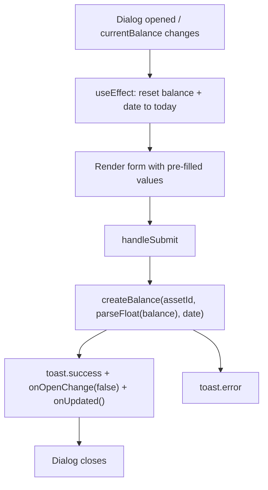

# Component - UpdateCashBalanceDialog

## Purpose
Modal dialog for recording a new cash balance snapshot for a cash asset. Pre-fills with the current balance and today's date. On submit, calls `createBalance` and notifies the parent to refresh its data.

## Usage

```tsx
<UpdateCashBalanceDialog
  assetId={asset.id}
  assetSymbol={asset.symbol}
  currentBalance={asset.current_balance}
  open={open}
  onOpenChange={setOpen}
  onUpdated={refetch}
/>
```

Used in: Component - CashAccountsSection (portfolio page cash holdings row)

## Props Interface

```typescript
interface Props {
  assetId: string;
  assetSymbol: string;
  currentBalance: number;
  open: boolean;
  onOpenChange: (open: boolean) => void;
  onUpdated: () => void;
}
```

| Prop | Type | Required | Default | Purpose |
| :--- | :--- | :--- | :--- | :--- |
| `assetId` | `string` | Yes | — | UUID of the cash asset to update |
| `assetSymbol` | `string` | Yes | — | Display name used in title and success toast |
| `currentBalance` | `number` | Yes | — | Pre-fills the balance input |
| `open` | `boolean` | Yes | — | Controls dialog visibility |
| `onOpenChange` | `(open: boolean) => void` | Yes | — | Dialog open state callback |
| `onUpdated` | `() => void` | Yes | — | Called after successful save; triggers parent refetch |

## State

### Local State — `useState`

| Variable | Type | Initial | Purpose |
| :--- | :--- | :--- | :--- |
| `balance` | `string` | `String(currentBalance)` | Controlled number input value |
| `date` | `string` | today `YYYY-MM-DD` | Date of the balance snapshot |
| `loading` | `boolean` | `false` | Disables submit button during API call |

State resets on `open` or `currentBalance` change via `useEffect`.

## Component Tree

```
UpdateCashBalanceDialog
└── Dialog (controlled open)
    └── DialogContent
        ├── DialogHeader → DialogTitle "Update {assetSymbol} Balance"
        └── form (onSubmit → handleSubmit)
            ├── Input type="number" (balance)
            ├── DatePicker (date)
            └── Button type="submit" (disabled while loading)
```

## Lifecycle



## Validation Rules

| Field | Rules | Error feedback |
| :--- | :--- | :--- |
| `balance` | `required` (HTML) | Browser native validation |
| Balance | Must parse to valid number via `parseFloat` | API error shown via `toast.error` |

## Related

| Role | Link |
| :--- | :--- |
| Parent | Component - CashAccountsSection |
| Sibling | Component - AddCashAccountDialog |
| Sibling | Component - EditCashAccountDialog |
| DB | DB - cash_balances |
