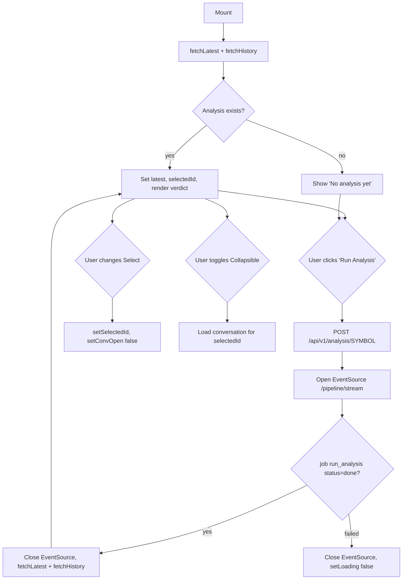

# Component - VerdictCard

## Purpose
VerdictCard displays AI-generated BUY/SELL/HOLD verdicts for a specific portfolio symbol. It self-initialises on mount by fetching the latest analysis and history directly via `fetch`. The user can trigger a new analysis run (which streams progress via `EventSource`), switch between past verdicts via a dropdown, and expand the full LLM conversation that produced the verdict. It respects privacy mode to blur the target price. Used on the Portfolio symbol detail page.

## Props
| Prop | Type | Required | Notes |
| :--- | :--- | :--- | :--- |
| `symbol` | `string` | Yes | Ticker symbol used to scope all API calls (`/api/v1/analysis/{symbol}/...`) |

## Component Tree
```
VerdictCard
└── Card
    ├── CardHeader
    │   ├── CardTitle "AI Analysis"
    │   └── Button "Run Analysis" / "Analysing..."
    └── CardContent
        ├── [displayed exists]
        │   ├── Badge (verdict color: BUY/SELL/HOLD)
        │   ├── span (target price, privacy-masked)
        │   ├── p (reasoning text)
        │   ├── p (model + cost_usd)
        │   ├── Select (past verdicts dropdown, if history > 1)
        │   └── Collapsible (LLM conversation thread)
        └── [no displayed] p "No analysis yet"
```

## Data Layer

### Local State — `useState`
| Variable | Type | Purpose |
| :--- | :--- | :--- |
| `latest` | `Analysis \| null` | Most recent analysis fetched from API |
| `history` | `Analysis[]` | All past analyses for the symbol |
| `selectedId` | `string \| null` | ID of the verdict shown; defaults to latest |
| `loading` | `boolean` | True while an analysis is running |
| `conversation` | `{role: string, content: string}[]` | LLM turn-by-turn conversation for the displayed verdict |
| `convOpen` | `boolean` | Controls collapsible conversation panel |
| `initialized` | `boolean` | Guards against double-fetch on mount |

### Stores
| Store | Consumed | Purpose |
| :--- | :--- | :--- |
| `usePrivacyStore` | `isPrivate` | Masks target price with "••••" |

### API Calls
| Endpoint | Method | Trigger |
| :--- | :--- | :--- |
| `/api/v1/analysis/{symbol}/latest` | GET | Mount (`fetchLatest`) and after run completes |
| `/api/v1/analysis/{symbol}/history` | GET | Mount (`fetchHistory`) and after run completes |
| `/api/v1/analysis/{symbol}` | POST | "Run Analysis" button click |
| `/api/v1/pipeline/stream` | EventSource | Streams job status after POST to detect completion |

## Behavior


## Related
- Component - ConfirmLLMDialog
- Page - Portfolio Detail
