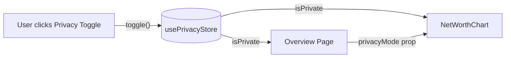

> Purpose: Manages a single boolean flag `isPrivate` that toggles privacy mode across the app — blurs monetary values for screen-sharing protection. Must be global because multiple pages and components read it simultaneously.

## File

`store/privacy.ts`


## State Shape

```typescript
interface PrivacyState {
  isPrivate: boolean;
  toggle: () => void;
  setPrivate: (value: boolean) => void;
}

export const usePrivacyStore = create<PrivacyState>()(
  persist(
    (set) => ({
      isPrivate: false,
      toggle: () => set((state) => ({ isPrivate: !state.isPrivate })),
      setPrivate: (value: boolean) => set({ isPrivate: value }),
    }),
    { name: "zentri-privacy" }
  )
);
```


## State Fields

| Field | Type | Initial | Description |
| :--- | :--- | :--- | :--- |
| `isPrivate` | `boolean` | `false` | When `true`, UI blurs/hides monetary values |


## Actions

| Action | Parameters | What it does | Side Effects |
| :--- | :--- | :--- | :--- |
| `toggle()` | — | Flips `isPrivate` between `true` / `false` | Writes to `localStorage["zentri-privacy"]` |
| `setPrivate(value)` | `value: boolean` | Sets `isPrivate` to exact value | Writes to `localStorage["zentri-privacy"]` |


## Persistence

| Property | Value |
| :--- | :--- |
| **Persisted** | Yes |
| **Middleware** | `zustand/middleware/persist` |
| **Storage** | `localStorage` (browser default) |
| **Storage Key** | `zentri-privacy` |
| **Excluded fields** | None — entire state is persisted |

The preference survives page refresh. User's privacy setting is remembered between sessions.


## Data Flow




## Consumers

| Page / Component | Fields Read | Actions Used |
| :--- | :--- | :--- |
| Page - Overview | `isPrivate` | — |
| `NetWorthChart` | via `privacyMode` prop (passed from Overview) | — |
| Layout / Navbar (if privacy toggle button exists) | — | `toggle()` |


## Related

| Role | Link |
| :--- | :--- |
| Primary Consumer | Page - Overview |
| Palette Store | Store - Palette |
