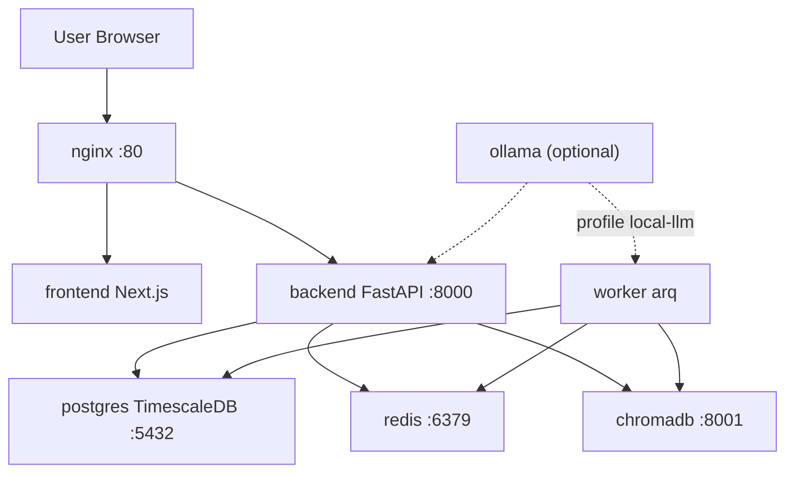

# DevOps - Zentri

## Service Topology

---

## Services

| Service | Image | Port | Purpose |
| :--- | :--- | :--- | :--- |
| `nginx` | `nginx:alpine` | `80:80` | Reverse proxy — routes `/api/*` to backend, all else to frontend |
| `frontend` | `./frontend` (Next.js) | 80 via nginx (dev: 3000) | React UI |
| `backend` | `./backend` (FastAPI) | `8000` (internal) | REST API + Alembic migrations on startup |
| `worker` | `./backend` | — | arq background job processor |
| `postgres` | `timescale/timescaledb:latest-pg16` | `5432:5432` | Primary database (TimescaleDB extension) |
| `redis` | `redis:7-alpine` | — (internal) | arq job queue broker |
| `chromadb` | `chromadb/chroma:latest` | `8001:8000` | Vector store for RAG (news articles, documents) |
| `ollama` | `ollama/ollama` | — | Local LLM inference; profile `local-llm` only |

---

## Environment Variables

Set in `.env` (copy from `.env.example`):

| Variable | Example | Notes |
| :--- | :--- | :--- |
| `POSTGRES_PASSWORD` | `strongpassword123` | DB password for postgres service |
| `JWT_SECRET` | `openssl rand -hex 32` | Signs JWT tokens — must be 32+ bytes |
| `TZ` | `Asia/Bangkok` | Timezone for scheduler and dividend calendar |
| `PRICE_FETCH_INTERVAL` | `15` | Minutes between price-fetch job runs (default: 15) |
| `OLLAMA_HOST` | `http://host.docker.internal:11434` | Mac: use Docker gateway; Linux+`--profile local-llm`: `http://ollama:11434` |
| `LOG_LEVEL` | `info` | uvicorn log level (debug, info, warning) |

Backend derives `DATABASE_URL` and `REDIS_URL` from `POSTGRES_PASSWORD` — not set separately in `.env`.

---

## Volumes

| Volume | Service | Purpose |
| :--- | :--- | :--- |
| `postgres_data` | postgres | Persistent DB data |
| `redis_data` | redis | Persistent queue state |
| `chroma_data` | chromadb | Persistent vector store |
| `ollama_data` | ollama | Downloaded model weights |

---

## Override (docker-compose.override.yml)

Auto-applied in dev (`docker compose up` without `-f` flag):

| Service | Override | Effect |
| :--- | :--- | :--- |
| `backend` | `--reload` flag + `./backend:/app` volume mount | Hot-reload on Python file changes |
| `worker` | `watchfiles` command + `./backend:/app` mount | Hot-reload for worker |
| `frontend` | `target: dev` build + `npm run dev` + port `3000:3000` | Next.js dev server with HMR |

Do not commit local hacks to `docker-compose.override.yml`.

---

## Nginx Config

`nginx/nginx.conf` routes:
- `/api/*` → `http://backend:8000` (proxy pass)
- All other paths → `http://frontend` (Next.js SSR)

---

## Worker / Queue

The `worker` service runs `python -m worker.main` (arq worker). In dev it uses `watchfiles` for hot-reload. The worker reads `price_schedule_config` rows at startup to build the arq cron schedule. Redis acts as the job broker.

---

## Common Operations

| Task | Command |
| :--- | :--- |
| Start dev | `docker compose up` |
| Start with local LLM | `docker compose --profile local-llm up` |
| Run migrations only | `docker compose run --rm backend alembic upgrade head` |
| Create new migration | `docker compose run --rm backend alembic revision --autogenerate -m "description"` |
| Access DB directly | `docker compose exec postgres psql -U postgres -d zentri` |
| Tail backend logs | `docker compose logs -f backend` |

---

## Related

- DB - price_schedule_config
- DB - prices
