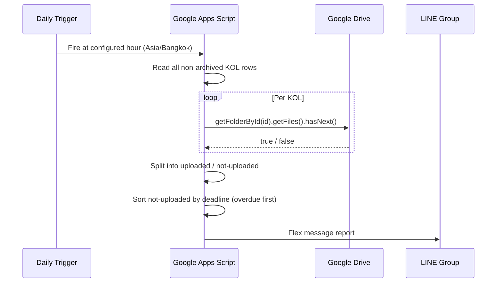

ARKA sends products to Key Opinion Leaders (KOLs) to promote on Instagram. With many active KOLs running simultaneously, there was no way to track who had shot and uploaded their content versus who had gone quiet after receiving the shipment. A Google Sheets tool with Drive folder automation and a daily LINE report closed that gap.

## About ARKA KOL Program

ARKA partners with KOLs to promote new collections on Instagram and TikTok. Each KOL receives a product shipment, shoots content in their own style, and uploads the files to a dedicated Google Drive folder. ARKA doesn't review content before posting — the Drive folder is proof that work happened.

## The Problem

With no system in place, tracking active KOLs relied entirely on memory. It was easy to send a product and only realise weeks later that the KOL never uploaded anything. There was no central record of who received what, when their deadline was, or whether they had actually delivered.

## KOL Tracking Sheet

The system is a Google Sheets bound script. Each row represents one KOL campaign:

- Instagram URL and follower count
- Name, phone, address, body proportions
- Products sent and delivery date
- Posting deadline
- Tracking number for the shipment
- Email (for Drive folder access)
- Drive folder URL
- Favorite and Archived flags

## Creating a Drive Folder

With a KOL row selected, the team runs **ARKA Tools → Create Drive Folder**. The script:

1. Reads the KOL's name and current month to build a folder name: `JUN2026-KOLName`
2. Creates the folder inside the configured root Drive directory
3. Adds the KOL's email as an editor
4. Writes the Drive URL back to the sheet row

If a folder already exists for that row, it is skipped. Duplicate names are handled by appending a counter: `JUN2026-KOLName-2`.

<figure>
  <ZoomableImage
    src="/projects/arka-kol-tracking/arka-tools-create-drive-folder.png"
    alt="ARKA Tools menu in Google Sheets showing Create Drive Folder option"
    className="border border-zinc-200 dark:border-zinc-800"
  />
  <figcaption className="mt-1 text-center text-xs text-zinc-500">
    ARKA Tools menu — one click creates a named Drive folder, adds the KOL as editor, and writes the URL back to the row.
  </figcaption>
</figure>

## Daily Upload Check via LINE

A time-based trigger runs daily at a configured hour (Bangkok timezone). For every active (non-archived) KOL row, the script extracts the Drive folder ID from the stored URL and calls `DriveApp.getFolderById(id).getFiles().hasNext()`. A folder with any files = uploaded. Empty folder = pending.

The report sorts KOLs by urgency: overdue (past deadline, no upload) first, then upcoming deadlines.

<figure>
  <ZoomableImage
    src="/projects/arka-kol-tracking/flex-message-report-kol-everyday.png"
    alt="Daily LINE report showing KOLs who haven't uploaded content"
    className="border border-zinc-200 dark:border-zinc-800"
  />
  <figcaption className="mt-1 text-center text-xs text-zinc-500">
    Daily LINE report — overdue KOLs at the top, upcoming deadlines below. Uploaded KOLs are counted but not listed.
  </figcaption>
</figure>

## Print Tracking Label

The same 6×4 inch label tool from the ARKA tracking system is included here for sending products to KOLs. Select a row, run **ARKA Tools → Print Tracking**, and a print-ready label appears with the KOL's name, phone, address, and products.

<figure>
  <ZoomableImage
    src="/projects/arka-kol-tracking/arka-tools-print-tracking.png"
    alt="ARKA Tools print tracking option in Sheets menu"
    className="border border-zinc-200 dark:border-zinc-800"
  />
  <figcaption className="mt-1 text-center text-xs text-zinc-500">
    Print Tracking in the menu — generates a 6×4 in label from the selected row's data.
  </figcaption>
</figure>

<figure>
  <ZoomableImage
    src="/projects/arka-kol-tracking/print-tracking-label-pdf.png"
    alt="Generated tracking label PDF for KOL shipment"
    className="border border-zinc-200 dark:border-zinc-800"
  />
  <figcaption className="mt-1 text-center text-xs text-zinc-500">
    Label output — 6×4 in, Sarabun font, print or save as PDF directly from the browser.
  </figcaption>
</figure>

## What I'd Do Differently

`driveHasFile()` uses a simple `hasNext()` check — any file in the folder counts as uploaded. This is intentional and works in practice since KOLs have no reason to upload dummy files. But it can't confirm that the content was actually published on Instagram; posting is assumed once files appear.

At current scale, calling `DriveApp` per KOL in a single trigger run is fast enough. If the KOL roster grew significantly, a Drive Changes API approach would be more efficient than polling every folder on each run.
