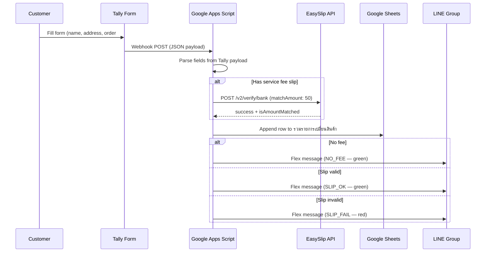

ARKA's clothing exchange flow used to require customers to find the store on LINE, explain the request in chat, pay ฿50 manually, send a slip screenshot, and wait for someone to log it by hand. Two Tally forms, EasySlip payment verification, and a LINE Messaging API push replaced all of that.

## About ARKA

[ARKA (arka.bkk)](https://www.instagram.com/arka.bkk/) is a Bangkok-based women's clothing boutique selling across:

- **Instagram**: [arka.bkk](https://www.instagram.com/arka.bkk/)
- **Shopee**: [arka.bangkok](https://shopee.co.th/arka.bangkok)
- **TikTok**: [@arka.bkk](https://www.tiktok.com/@arka.bkk)
- **Lazada**: [ARKA Bangkok](https://www.lazada.co.th/shop/k6gz37mz)

## The Problem

Customers who wanted to exchange a size had to move off-platform — find ARKA on LINE, start a chat, explain what they wanted, pay ฿50 manually, and photograph the payment slip inside LINE. From there the team handled everything by hand: checking the slip, logging the request, remembering to follow up when the returned item arrived. Nothing was trackable across more than a few open cases at once.

There are two exchange scenarios:

- **No service fee** — ARKA sent the wrong item or the item was defective. The customer bears no cost.
- **฿50 service fee** — The customer ordered and wants a different size. A fee covers return shipping handling.

## Exchange Flow

Two separate Tally forms handle each scenario. Both post to the same Google Apps Script webhook.

- [Exchange Request — with service fee (฿50)](https://tally.so/r/yP7QO8)
- [Exchange Request — no service fee](https://tally.so/r/D4WjKq)

<figure>
  <ZoomableImage
    src="/projects/arka-product-return/tally-form-product-return.png"
    alt="Tally form for product exchange request"
    className="border border-zinc-200 dark:border-zinc-800"
  />
  <figcaption className="mt-1 text-center text-xs text-zinc-500">
    Tally form — customer fills name, address, order number, sizes, and optionally uploads a payment slip.
  </figcaption>
</figure>

<figure>
  <ZoomableImage
    src="/projects/arka-product-return/flex-message-noti-when-submission-form.png"
    alt="LINE flex message notification on form submission"
    className="border border-zinc-200 dark:border-zinc-800"
  />
  <figcaption className="mt-1 text-center text-xs text-zinc-500">
    LINE group notification — fires immediately when a form is submitted. Green for verified or no-fee cases.
  </figcaption>
</figure>

<figure>
  <ZoomableImage
    src="/projects/arka-product-return/flex-message-slip-wrong.png"
    alt="LINE flex message when payment slip fails verification"
    className="border border-zinc-200 dark:border-zinc-800"
  />
  <figcaption className="mt-1 text-center text-xs text-zinc-500">
    Red notification — EasySlip returned success: false or amount didn't match ฿50.
  </figcaption>
</figure>

## Receiving the Return

When the customer ships the old item back and the team receives it, they check a checkbox in the Google Sheets row. An installable `onEdit` trigger fires and pushes a "ready to pack" notification to LINE — signalling that the replacement can now be prepared and sent.

<figure>
  <ZoomableImage
    src="/projects/arka-product-return/flex-message-ready-to-pack.png"
    alt="LINE flex message when returned product is received"
    className="border border-zinc-200 dark:border-zinc-800"
  />
  <figcaption className="mt-1 text-center text-xs text-zinc-500">
    "Product received" notification — triggers when the team checks the received checkbox in Sheets.
  </figcaption>
</figure>

## Daily Pending Report

A time-based trigger runs daily and scans the sheet for rows where the returned item has not yet been received. It pushes a summary flex message to LINE so no case goes forgotten.

<figure>
  <ZoomableImage
    src="/projects/arka-product-return/everyday-report.png"
    alt="Daily LINE report of pending exchange cases"
    className="border border-zinc-200 dark:border-zinc-800"
  />
  <figcaption className="mt-1 text-center text-xs text-zinc-500">
    Daily report — lists every open exchange request still waiting for the returned item.
  </figcaption>
</figure>

## Print Tracking Label

Before sending the replacement product, the team selects the row in Sheets and runs **Print Tracking** from the ARKA Tools menu. A 6×4 inch label renders in a modal with the customer's name, phone, and address — ready to print or save as PDF.

## What I'd Do Differently

The `getLastRow()` call to find where to append new rows returned 1000+ instead of the actual last data row. Formatting applied to the entire column E with `setNumberFormat('@')` inflated what Sheets considered the last row. The fix was scoping the number format to the data range only, not the whole column.

The EasySlip `matchAmount` check is strict — a ฿49 payment fails just like a fake slip. That's intentional, but any bank-side rounding would cause a false failure that forces the customer to resubmit.
