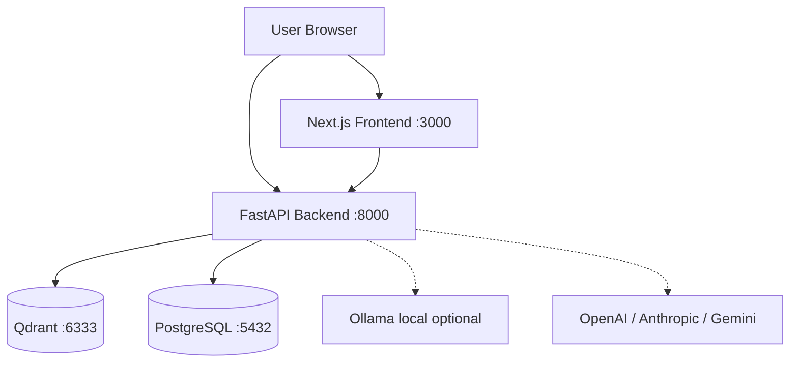

## The Problem

Most RAG tools force you to choose between privacy and capability — cloud-based tools send your documents to third-party servers, while local alternatives are painful to set up and lack multimodal support.

DocRAG is a self-hosted RAG engine that handles PDFs, Excel sheets, PlantUML diagrams, images, and source code in one place. It runs entirely via Docker — your documents never leave your machine.

## Features

- **Multimodal ingestion** — PDF, DOCX, images (via Docling layout-aware parsing), CSV, XLSX, JSON, Markdown, PUML, and source code
- **Streaming chat** — SSE-based streaming responses with intent classification (Document Analyst, Code Architect, Summarizer, and more)
- **Source citations** — every assistant response shows the exact document chunks used as context
- **Multi-provider LLM** — switch between Ollama (local), OpenAI, Anthropic, and Gemini from the Settings page — no `.env` edits required
- **Self-hosted vector store** — Qdrant v1.17.0 with gRPC support for fast high-throughput ingestion
- **Session history** — full chat history persisted in PostgreSQL with export/import support
- **Runtime RAG tuning** — adjust top-k and score threshold from the Settings page without restarting

## System Architecture

## Key Technical Decisions

| Decision         | Chosen                              | Rejected                   | Why                                                                        |
| ---------------- | ----------------------------------- | -------------------------- | -------------------------------------------------------------------------- |
| Document parsing | Docling                             | PyMuPDF / pdfplumber       | Layout-aware parsing preserves reading order and handles multi-column PDFs |
| Vector store     | Qdrant                              | ChromaDB / FAISS           | gRPC support, built-in dashboard, production-grade persistence             |
| Embedding model  | nomic-embed-text-v1.5 (768-dim)     | all-MiniLM-L6-v2 (384-dim) | 8192-token context window — better for long document chunks                |
| LLM key storage  | PostgreSQL (`appsetting` table)     | `.env` file                | Runtime key management via Settings UI without container restarts          |
| Streaming        | SSE via FastAPI `StreamingResponse` | WebSocket                  | Simpler client-side with `ReadableStream`; no persistent connection needed |

## What I'd Do Differently

Add a document deduplication check at ingestion time. Currently uploading the same file twice creates duplicate vector points — the document list shows two entries and retrieval quality degrades. A content hash check before upsert would prevent this with minimal overhead.

I'd also add chunk-level metadata richer than just `file_name` and `page_number` — section titles and element types are already extracted by Docling but could be used more aggressively to improve retrieval precision with metadata filters.
