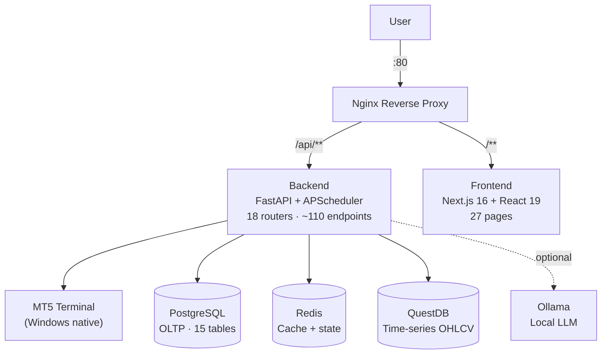

## The Problem

Running forex strategies on MetaTrader 5 means staring at charts, manually deciding when signals are valid, and keeping the terminal open around the clock. Switching between MT5, a spreadsheet for tracking performance, and various news feeds is friction-heavy and doesn't scale past one account. There was no way to ask an LLM "should I enter this trade?" and get a traceable, logged answer.

LLMSystemTrading replaces that manual loop with a fully automated pipeline: LLM agents research the market, generate signals, route orders to MT5, and log every decision to a queryable database — with a full-featured dashboard to monitor and control it all.

## System Architecture

The frontend and backend run in Docker alongside three databases. MT5 runs natively on Windows — `python-mt5` bridges the gap over a local socket. Nginx routes all traffic: `/api/**` proxies to FastAPI, everything else hits the Next.js SSR server.

## Multi-Agent LLM Pipeline

Each scheduled run passes through a sequential agent chain:

| Stage | Agent | Output |
|-------|-------|--------|
| 1. Research | Market Research Agent | News sentiment, macro context |
| 2. Analysis | Market Analysis Agent | Chart pattern + indicator summary |
| 3. Signal | Signal Generation Agent | BUY / SELL / HOLD + confidence score |
| 4. Execution | MT5 Bridge | Order placed, ticket logged |
| 5. Audit | LLM Audit Logger | Full token trace written to `llm_calls` + `ai_journal` |

APScheduler triggers the chain on configurable cron intervals per strategy. Every LLM call is logged with provider, model, token count, cost, and the full response — visible in the LLM Analytics and LLM Usage pages.

## Features

| Page | Purpose |
|------|---------|
| Dashboard | Live positions, P&L, account equity, WebSocket clock |
| Accounts | MT5 account credentials and trading config per account |
| Strategies | Define strategies with LLM overrides and risk parameters |
| Backtest | Run and compare historical backtests with full metrics |
| LLM Analytics | Per-agent signal accuracy, confidence distribution |
| LLM Usage | Token consumption and cost breakdown by provider/model |
| Schedule | View and control APScheduler cron jobs |
| Pipeline Logs | Step-by-step execution trace for every pipeline run |
| News | Aggregated news feed used by research agents |
| Analytics | Aggregate P&L, win rate, drawdown charts |
| Trades | Full trade history with entry/exit/ticket details |
| Settings | Global risk settings, Telegram alerts, LLM provider keys |
| Storage | QuestDB candle data storage management |
| System Usage | Host CPU, memory, and disk utilisation |

## Key Technical Decisions

| Decision | Chosen | Rejected | Why |
|----------|--------|----------|-----|
| Time-series storage | QuestDB | PostgreSQL for all | OHLCV candle inserts via InfluxDB line protocol are orders of magnitude faster in a columnar TSDB |
| Job scheduling | APScheduler | Celery + RabbitMQ | Single-machine deployment; APScheduler runs in-process with zero infra overhead |
| MT5 connection | python-mt5 (native) | Docker container | MT5 is a Windows application; it cannot run inside a container |
| LLM provider | Abstracted (Anthropic / OpenAI / Gemini / OpenRouter) | Hard-coded provider | Allows hot-swapping models per task without code changes |
| LLM key storage | Fernet-encrypted in DB | Plain env vars | Keys survive container rebuilds; displayed masked in the UI |
| Frontend state | Zustand | Redux / React Query | Lightweight, no boilerplate; fits a 27-page internal dashboard |

## Screenshots

<ScreenshotGrid>

  <figure>
    <ZoomableImage
      src="/projects/llmsystemtrading/dashboard-page.png"
      alt="Dashboard — live positions and account equity"
      className="border border-zinc-200 dark:border-zinc-800"
    />
    <figcaption className="mt-1 text-center text-xs text-zinc-500">
      Dashboard
    </figcaption>
  </figure>

  <figure>
    <ZoomableImage
      src="/projects/llmsystemtrading/account-page.png"
      alt="Accounts — MT5 credentials and trading config"
      className="border border-zinc-200 dark:border-zinc-800"
    />
    <figcaption className="mt-1 text-center text-xs text-zinc-500">
      Accounts
    </figcaption>
  </figure>

  <figure>
    <ZoomableImage
      src="/projects/llmsystemtrading/analytics-page.png"
      alt="Analytics — P&L and win rate charts"
      className="border border-zinc-200 dark:border-zinc-800"
    />
    <figcaption className="mt-1 text-center text-xs text-zinc-500">
      Analytics
    </figcaption>
  </figure>

  <figure>
    <ZoomableImage
      src="/projects/llmsystemtrading/backtest-page.png"
      alt="Backtest — historical strategy performance"
      className="border border-zinc-200 dark:border-zinc-800"
    />
    <figcaption className="mt-1 text-center text-xs text-zinc-500">
      Backtest
    </figcaption>
  </figure>

  <figure>
    <ZoomableImage
      src="/projects/llmsystemtrading/llm-usage-page.png"
      alt="LLM Usage — token consumption and cost by provider"
      className="border border-zinc-200 dark:border-zinc-800"
    />
    <figcaption className="mt-1 text-center text-xs text-zinc-500">
      LLM Usage
    </figcaption>
  </figure>

  <figure>
    <ZoomableImage
      src="/projects/llmsystemtrading/mt5-screenshot.png"
      alt="MetaTrader 5 — connected terminal"
      className="border border-zinc-200 dark:border-zinc-800"
    />
    <figcaption className="mt-1 text-center text-xs text-zinc-500">
      MT5 Terminal
    </figcaption>
  </figure>

  <figure>
    <ZoomableImage
      src="/projects/llmsystemtrading/pipeline-log-page.png"
      alt="Pipeline Logs — step-by-step agent execution trace"
      className="border border-zinc-200 dark:border-zinc-800"
    />
    <figcaption className="mt-1 text-center text-xs text-zinc-500">
      Pipeline Logs
    </figcaption>
  </figure>

</ScreenshotGrid>

## What I'd Do Differently

Move to Celery with a Redis broker from the start. APScheduler is convenient for a single machine, but the moment a second instance needs to share the job queue — or a run needs to be offloaded to a worker process — it becomes a bottleneck. Designing around a message queue from day one would make horizontal scaling straightforward.

I'd also add authentication before building any features. The system currently has no auth layer — it's safe behind a firewall, but adding it retroactively across 27 pages and ~110 endpoints is a larger lift than wiring it in at route setup time.
