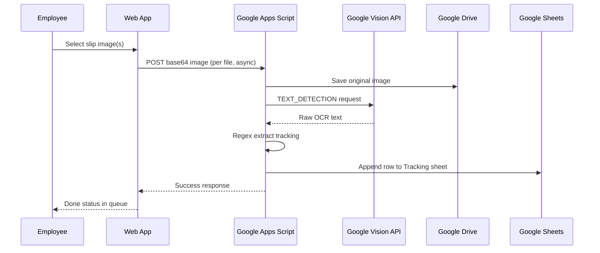
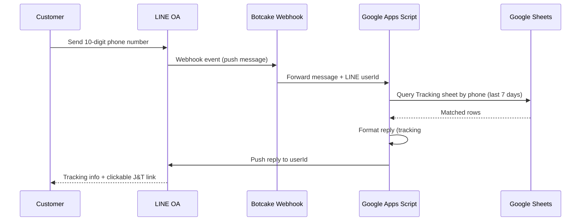

My sister runs a clothing boutique — ARKA — selling across Shopee, TikTok, Lazada, Instagram, and Facebook. Orders from social media are shipped through J&T Express, a courier with no integration into any of those platforms. Built in a single day (6–8 hours), this system removes the manual tracking data entry entirely.

## About ARKA

[ARKA (arka.bkk)](https://www.instagram.com/arka.bkk/) is a Bangkok-based women's clothing store selling across four platforms:

- **Instagram**: [arka.bkk](https://www.instagram.com/arka.bkk/)
- **Shopee**: [arka.bangkok](https://shopee.co.th/arka.bangkok)
- **TikTok**: [@arka.bkk](https://www.tiktok.com/@arka.bkk)
- **Lazada**: [ARKA Bangkok](https://www.lazada.co.th/shop/k6gz37mz)

## The Problem

Shopee, TikTok, and Lazada each have built-in shipping integrations — tracking numbers flow automatically. Instagram and Facebook orders don't. Those get shipped via J&T Express: the J&T employee hands over a printed slip with the customer's name, phone number, and tracking number.

Previously, someone had to read that slip and manually enter the data. With dozens of orders a day, that's a real time sink — and typos meant customers couldn't find their parcels.

## Employee Upload Flow

The J&T employee photographs the slip on their phone and opens the web app. They can select multiple images at once; each uploads in parallel.

<figure>
  <ZoomableImage
    src="/projects/tracking-arka/J_T-upload-image-tracking.jpg"
    alt="J&T Express slip showing customer name, tracking number, and phone number"
    className="border border-zinc-200 dark:border-zinc-800"
  />
  <figcaption className="mt-1 text-center text-xs text-zinc-500">
    J&T slip — the raw input. Google Vision API reads the printed text.
  </figcaption>
</figure>

<figure>
  <ZoomableImage
    src="/projects/tracking-arka/arka-web-upload-images.png"
    alt="ARKA web app upload screen"
    className="border border-zinc-200 dark:border-zinc-800"
  />
  <figcaption className="mt-1 text-center text-xs text-zinc-500">
    Upload screen — employee taps to photograph or select slip images.
  </figcaption>
</figure>

<figure>
  <ZoomableImage
    src="/projects/tracking-arka/arka-web-upload-images-queue.png"
    alt="Upload queue showing files being processed in parallel"
    className="border border-zinc-200 dark:border-zinc-800"
  />
  <figcaption className="mt-1 text-center text-xs text-zinc-500">
    Queue view — multiple slips processing in parallel.
  </figcaption>
</figure>

<figure>
  <ZoomableImage
    src="/projects/tracking-arka/arka-web-upload-images-done.png"
    alt="Upload complete — all slips processed successfully"
    className="border border-zinc-200 dark:border-zinc-800"
  />
  <figcaption className="mt-1 text-center text-xs text-zinc-500">
    All done — each row shows success status.
  </figcaption>
</figure>

## Customer Tracking via LINE OA

Customers message the ARKA LINE Official Account with their 10-digit phone number. The system looks up their orders from the past 7 days and replies with tracking details and a direct J&T tracking link.

<figure>
  <ZoomableImage
    src="/projects/tracking-arka/line-oa-arka-tracking.PNG"
    alt="ARKA LINE OA interface"
    className="border border-zinc-200 dark:border-zinc-800"
  />
  <figcaption className="mt-1 text-center text-xs text-zinc-500">
    ARKA LINE OA — customer entry point.
  </figcaption>
</figure>

<figure>
  <ZoomableImage
    src="/projects/tracking-arka/line-oa-arka-tracking-output.PNG"
    alt="LINE OA reply showing tracking number and J&T link"
    className="border border-zinc-200 dark:border-zinc-800"
  />
  <figcaption className="mt-1 text-center text-xs text-zinc-500">
    Reply — tracking number, order date, and a direct J&T link.
  </figcaption>
</figure>

<figure>
  <ZoomableImage
    src="/projects/tracking-arka/line-oa-arka-click-tracking-J_T.PNG"
    alt="Customer tapping the J&T tracking button in LINE OA"
    className="border border-zinc-200 dark:border-zinc-800"
  />
  <figcaption className="mt-1 text-center text-xs text-zinc-500">
    Customer queries tracking status with their phone number.
  </figcaption>
</figure>

## Data in Google Sheets

Every processed slip writes one row: timestamp, tracking number, customer name, phone, tracking date, a clickable J&T tracking link, processing status, and a link to the original image in Google Drive.

<figure>
  <ZoomableImage
    src="/projects/tracking-arka/spreadsheet-tracking-1.png"
    alt="Google Sheets tracking data — overview"
    className="border border-zinc-200 dark:border-zinc-800"
  />
  <figcaption className="mt-1 text-center text-xs text-zinc-500">
    Tracking sheet — one row per J&T slip.
  </figcaption>
</figure>

<figure>
  <ZoomableImage
    src="/projects/tracking-arka/spreadsheet-tracking-2.png"
    alt="Google Sheets tracking data — detail view"
    className="border border-zinc-200 dark:border-zinc-800"
  />
  <figcaption className="mt-1 text-center text-xs text-zinc-500">
    Each row links back to the original slip image in Google Drive.
  </figcaption>
</figure>

## What I'd Do Differently

The regex extraction works well for J&T's current slip format, but it's brittle — a layout change from J&T would break it. A more robust approach would use Vision API's bounding-box coordinates to locate fields by position rather than pattern-matching raw text.

The LINE OA integration routes through Botcake as a webhook proxy, which adds a dependency outside my control. A direct LINE Messaging API webhook would be more reliable long-term.
