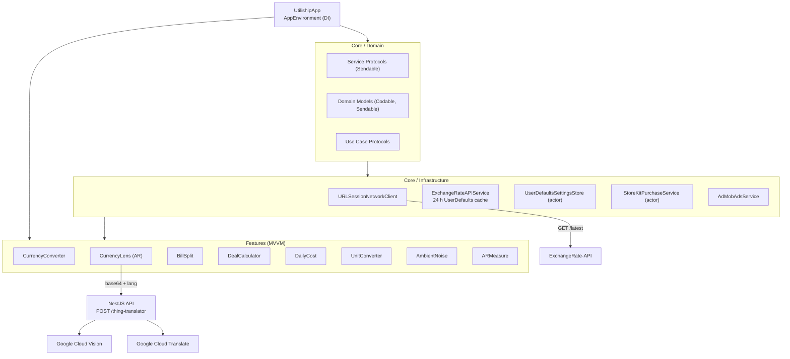

[View Documentation →](/en/docs/utiliship/architecture)

## The Problem

Every utility app on my phone did one thing: a currency converter here, a bill splitter there, a unit converter somewhere else. Switching between five apps just to split a restaurant bill and convert the total to home currency felt absurd. Utiliship is one app with all of them — and then some.

## Features

- **Currency Converter** — real-time rates via ExchangeRate-API, 24 h cache for offline use, multi-target conversion, preset pairs, and a home-screen widget
- **Currency Lens** — point the camera at a price tag; live AR overlays show the converted amount pinned to the price
- **Bill Splitter** — three-step wizard: add participants, assign items per person, get per-person totals with configurable rounding; auto-saves history
- **Deal Calculator** — compare up to 10 products by price-per-unit across weight, volume, area, and more
- **Daily Cost** — enter a purchase price and start date; see daily/weekly/monthly depreciation cost
- **Unit Converter** — length, weight, temperature, area, volume, speed, data storage — metric and imperial
- **Ambient Noise Meter** — real-time dB level with min/max/average statistics
- **AR Measure** — walk mode (camera odometry) and visual mode (ARKit plane detection) for distance and surface measurement
- **Thing Translator** — point at any object; Google Vision identifies it and Google Translate names it in your language
- **Settings** — preferred currency, measurement system, theme, and Pro subscription via StoreKit 2

## System Architecture

## Key Technical Decisions

| Decision | Chosen | Rejected | Why |
|----------|--------|----------|-----|
| Concurrency | Swift 6 strict mode | Swift 5 + manual locks | Compile-time data-race safety; every service is Sendable |
| DI | `AppEnvironment` env key | Singletons / service locator | Testable, no global state, SwiftUI-native |
| Rate caching | UserDefaults (24 h TTL) | Core Data / SQLite | Rates are a single JSON blob; UserDefaults is sufficient |
| Object recognition | Google Cloud Vision | CoreML VisionKit | Far higher label accuracy for arbitrary real-world objects |
| Monetisation | StoreKit 2 + AdMob | Web paywall | Native IAP required for App Store; AdMob for free tier |
| Backend | NestJS (TypeScript) | Python / FastAPI | Familiar stack, Docker-friendly, thin proxy layer |

## Screenshots

<ScreenshotGrid>

  <figure>
    <ZoomableImage
      src="/projects/utiliship/home-view.PNG"
      alt="Home screen utility grid"
      className="border border-zinc-200 dark:border-zinc-800"
    />
    <figcaption className="mt-1 text-center text-xs text-zinc-500">
      Home
    </figcaption>
  </figure>

  <figure>
    <ZoomableImage
      src="/projects/utiliship/currency-converter-view.PNG"
      alt="Currency converter with multi-target results"
      className="border border-zinc-200 dark:border-zinc-800"
    />
    <figcaption className="mt-1 text-center text-xs text-zinc-500">
      Currency Converter
    </figcaption>
  </figure>

  <figure>
    <ZoomableImage
      src="/projects/utiliship/ar-currency-converter.PNG"
      alt="AR Currency Lens overlaying converted prices on camera"
      className="border border-zinc-200 dark:border-zinc-800"
    />
    <figcaption className="mt-1 text-center text-xs text-zinc-500">
      Currency Lens (AR)
    </figcaption>
  </figure>

  <figure>
    <ZoomableImage
      src="/projects/utiliship/bill-setup-view.PNG"
      alt="Bill splitter setup — participants and charges"
      className="border border-zinc-200 dark:border-zinc-800"
    />
    <figcaption className="mt-1 text-center text-xs text-zinc-500">
      Bill Splitter — Setup
    </figcaption>
  </figure>

  <figure>
    <ZoomableImage
      src="/projects/utiliship/bill-splitter-view-1.PNG"
      alt="Bill splitter item assignment"
      className="border border-zinc-200 dark:border-zinc-800"
    />
    <figcaption className="mt-1 text-center text-xs text-zinc-500">
      Bill Splitter — Items
    </figcaption>
  </figure>

  <figure>
    <ZoomableImage
      src="/projects/utiliship/bill-splitter-view-2.PNG"
      alt="Bill splitter result per person"
      className="border border-zinc-200 dark:border-zinc-800"
    />
    <figcaption className="mt-1 text-center text-xs text-zinc-500">
      Bill Splitter — Result
    </figcaption>
  </figure>

  <figure>
    <ZoomableImage
      src="/projects/utiliship/deal-calculator-1.PNG"
      alt="Deal calculator item entry"
      className="border border-zinc-200 dark:border-zinc-800"
    />
    <figcaption className="mt-1 text-center text-xs text-zinc-500">
      Deal Calculator
    </figcaption>
  </figure>

  <figure>
    <ZoomableImage
      src="/projects/utiliship/daily-cost-view.PNG"
      alt="Daily cost depreciation calculator"
      className="border border-zinc-200 dark:border-zinc-800"
    />
    <figcaption className="mt-1 text-center text-xs text-zinc-500">
      Daily Cost
    </figcaption>
  </figure>

  <figure>
    <ZoomableImage
      src="/projects/utiliship/unit-converter-view.PNG"
      alt="Unit converter with category picker"
      className="border border-zinc-200 dark:border-zinc-800"
    />
    <figcaption className="mt-1 text-center text-xs text-zinc-500">
      Unit Converter
    </figcaption>
  </figure>

  <figure>
    <ZoomableImage
      src="/projects/utiliship/ambient-noise-view.PNG"
      alt="Ambient noise meter with dB gauge"
      className="border border-zinc-200 dark:border-zinc-800"
    />
    <figcaption className="mt-1 text-center text-xs text-zinc-500">
      Ambient Noise
    </figcaption>
  </figure>

  <figure>
    <ZoomableImage
      src="/projects/utiliship/ar-measure-wall.PNG"
      alt="AR measure — wall surface detection"
      className="border border-zinc-200 dark:border-zinc-800"
    />
    <figcaption className="mt-1 text-center text-xs text-zinc-500">
      AR Measure
    </figcaption>
  </figure>

  <figure>
    <ZoomableImage
      src="/projects/utiliship/settings-view.PNG"
      alt="Settings screen with Pro upgrade"
      className="border border-zinc-200 dark:border-zinc-800"
    />
    <figcaption className="mt-1 text-center text-xs text-zinc-500">
      Settings
    </figcaption>
  </figure>

  <figure>
    <ZoomableImage
      src="/projects/utiliship/currency-widget.PNG"
      alt="Home screen currency widget"
      className="border border-zinc-200 dark:border-zinc-800"
    />
    <figcaption className="mt-1 text-center text-xs text-zinc-500">
      Widget
    </figcaption>
  </figure>

</ScreenshotGrid>

## What I'd Do Differently

Write the design system first. I rebuilt `AppColors` and `Spacing` three times as the feature count grew — each feature had slightly different layout assumptions baked in. A token-based design system defined upfront would have saved that rework.

I'd also add a coordinator pattern for navigation from day one. Using `AppRoute` directly in `HomeView` works for ten features, but adding deep links revealed that mixing navigation logic into the view made it painful. A dedicated coordinator would own all routing decisions cleanly.
